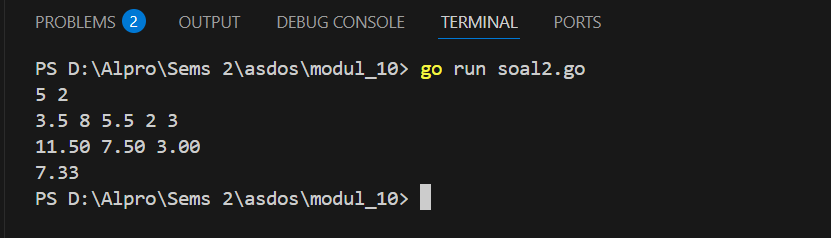
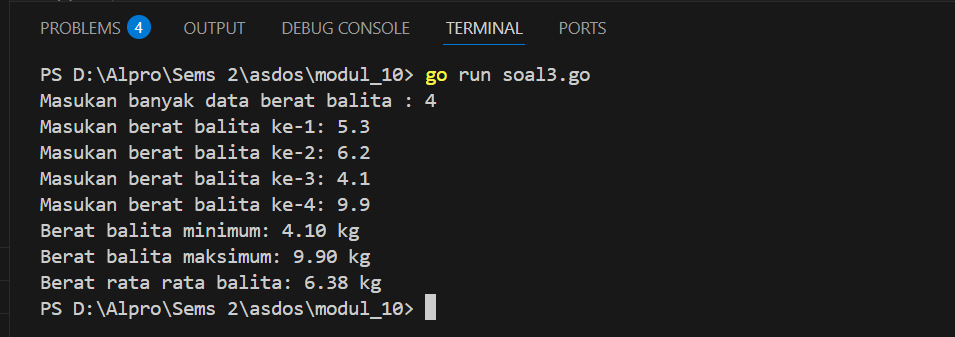

<h1 align="center">Laporan Praktikum Modul 10 <br> PENCARIAN NILAI EKSTRIM PADA HIMPUNAN DATA </h1>
___
<h5 align="center">Zidane Aji Noegroho - 103112430006 </h5>
### Unguided
___
### Soal 1
Sebuah program digunakan untuk mendata berat anak kelinci yang akan dijual ke pasar. Program ini menggunakan array dengan kapasitas 1000 untuk menampung data berat anak kelinci yang akan dijual.
Masukan terdiri dari sekumpulan bilangan, yang mana bilangan pertama adalah bilangan bulat N yang menyatakan banyaknya anak kelinci yang akan ditimbang beratnya. Selanjutnya N bilangan riil berikutnya adalah berat dari anak kelinci yang akan dijual.
Keluaran terdiri dari dua buah bilangan riil yang menyatakan berat kelinci terkecil dan terbesar.

```go
package main

import (
	"fmt"
)

func main() {
	var beratKelinci [1000]float64
	var N int
	fmt.Print("Masukkan jumlah anak kelinci: ")
	fmt.Scan(&N)

	if N > 1000 {
		fmt.Println("Jumlah anak kelinci melebihi kapasitas maksimal (1000)")
		return
	}

	fmt.Println("Masukkan berat masing-masing anak kelinci:")
	for i := 0; i < N; i++ {
		fmt.Scan(&beratKelinci[i])
	}

	min := beratKelinci[0]
	max := beratKelinci[0]

	for i := 1; i < N; i++ {
		if beratKelinci[i] < min {
			min = beratKelinci[i]
		}
		if beratKelinci[i] > max {
			max = beratKelinci[i]
		}
	}

	fmt.Printf("Berat terkecil: %.2f\n", min)
	fmt.Printf("Berat terbesar: %.2f\n", max)
}
```



Program ini dimulai dengan mendeklarasikan sebuah array berukuran 1000 untuk menyimpan data berat kelinci. Lalu, user diminta memasukkan jumlah anak kelinci yang akan ditimbang. Jika jumlahnya lebih dari 1000, program akan menampilkan pesan error dan berhenti.

Setelah itu, user memasukkan berat masing-masing kelinci satu per satu. Program kemudian mencari nilai berat terkecil dan terbesar dengan membandingkan setiap data yang dimasukkan. Terakhir, program mencetak berat terkecil dan terbesar yang ditemukan, dengan format dua angka di belakang koma.

### Soal 2
Sebuah program digunakan untuk menentukan tarif ikan yang akan dijual ke pasar. Program ini menggunakan array dengan kapasitas 1000 untuk menampung data berat ikan yang akan dijual.
Masukan terdiri dari dua baris, yang mana baris pertama terdiri dari dua bilangan bulat x dan y. Bilangan x menyatakan banyaknya ikan yang akan dijual, sedangkan y adalah banyaknya ikan yang akan dimasukan ke dalam wadah. Baris kedua terdiri dari sejumlah x bilangan riil yang menyatakan banyaknya ikan yang akan dijual.
Keluaran terdiri dari dua baris. Baris pertama adalah kumpulan bilangan riil yang menyatakan total berat ikan di setiap wadah (jumlah wadah tergantung pada nilai x dan y, urutan ikan yang dimasukan ke dalam wadah sesuai urutan pada masukan baris ke-2). Baris kedua adalah sebuah bilangan riil yang menyatakan berat rata-rata ikan di setiap wadah.

```go
package main

import (
	"fmt"
)

func main() {
	var x, y int
	var ikan [1000]float64

	fmt.Scan(&x, &y)

	for i := 0; i < x; i++ {
		fmt.Scan(&ikan[i])
	}

	jumlahWadah := (x + y - 1) / y
	totalIkanPerWadah := make([]float64, jumlahWadah)

	for i := 0; i < x; i++ {
		idx := i / y
		totalIkanPerWadah[idx] += ikan[i]
	}

	var totalBerat float64
	for i := 0; i < jumlahWadah; i++ {
		fmt.Printf("%.2f ", totalIkanPerWadah[i])
		totalBerat += totalIkanPerWadah[i]
	}
	fmt.Println()
	fmt.Printf("%.2f\n", totalBerat/float64(jumlahWadah))
}

```


Program ini dibuat untuk mengecek berat ikan perwadah dan mencari berat rata rata perwadah nya lalu program membaca dua nilai, yaitu jumlah ikan yang akan dijual dan kapasitas ikan per wadah. Setelah itu, program membaca berat dari masing-masing ikan dan menyimpannya dalam array. Lalu, program menghitung berapa banyak wadah yang diperlukan. Masing-masing ikan dimasukkan ke dalam wadah secara berurutan sesuai kapasitas, lalu dihitung total berat ikan di tiap wadah. Setelah semua wadah terisi, program menampilkan total berat di setiap wadah pada baris pertama, dan berat rata-rata semua wadah pada baris kedua.

### soal 3
Pos Pelayanan Terpadu (posyandu) sebagai tempat pelayanan kesehatan perlu mencatat data berat balita (dalam kg). Petugas akan memasukkan data tersebut ke dalam array. Dari data yang diperoleh akan dicari berat balita terkecil, terbesar, dan reratanya.

```go
package main

import (
	"fmt"
)

type arrBalita [100]float64

func hitungMinMax(arrBerat arrBalita, n int, bMin *float64, bMax *float64) {
	*bMin = arrBerat[0]
	*bMax = arrBerat[0]
	for i := 1; i < n; i++ {
		if arrBerat[i] < *bMin {
			*bMin = arrBerat[i]
		}
		if arrBerat[i] > *bMax {
			*bMax = arrBerat[i]
		}
	}
}

func rerata(arrBerat arrBalita, n int) float64 {
	var total float64 = 0
	for i := 0; i < n; i++ {
		total += arrBerat[i]
	}
	return total / float64(n)
}

func main() {
	var berat arrBalita
	var n int
	fmt.Print("Masukan banyak data berat balita : ")
	fmt.Scan(&n)

	for i := 0; i < n; i++ {
		fmt.Printf("Masukan berat balita ke-%d: ", i+1)
		fmt.Scan(&berat[i])
	}

	var min, max float64
	hitungMinMax(berat, n, &min, &max)
	rata := rerata(berat, n)

	fmt.Printf("Berat balita minimum: %.2f kg\n", min)
	fmt.Printf("Berat balita maksimum: %.2f kg\n", max)
	fmt.Printf("Berat rata rata balita: %.2f kg\n", rata)
}
```



Program ini dibuat untuk mencatat data berat badan balita, lalu menghitung nilai minimum, maksimum, dan rata-rata dari data yang dimasukkan. Program menggunakan array untuk menyimpan data berat hingga 100 balita. User diminta memasukkan jumlah data dan berat masing-masing balita. Kemudian, fungsi hitungMinMax mencari berat terkecil dan terbesar, dan fungsi rerata menghitung rata-ratanya.