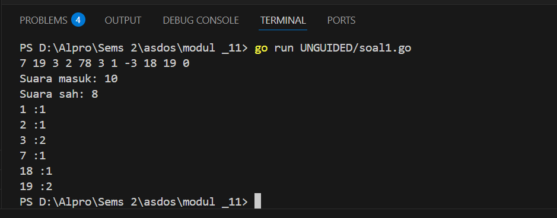
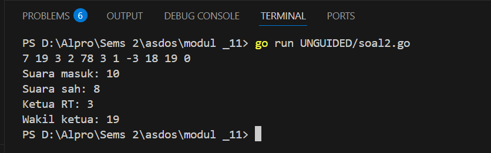

<h1 align="center">Laporan Praktikum Modul 5 <br> PENCARIAN NILAI ACAK PADA HIMPUNAN DATA </h1>
___
<h5 align="center">Zidane Aji Noegroho - 103112430006 </h5>
### Guided
___
### Soal 1

```go
package main

import "fmt"

func cariBarang(daftar []string, x string) bool {
	for _, barang := range daftar {
		if barang == x {
			return true
		}
	}
	return false
}

func main() {
	var n int
	fmt.Print("Masukkan jumlah barang: ")
	fmt.Scan(&n)

	daftarBarang := make([]string, n)
	fmt.Println("Masukkan nama-nama barang:")
	for i := 0; i < n; i++ {
		fmt.Scan(&daftarBarang[i])
	}

	var barangDicari string
	fmt.Print("Masukkan nama barang yang dicari: ")
	fmt.Scan(&barangDicari)

	ditemukan := cariBarang(daftarBarang, barangDicari)
	fmt.Println(ditemukan)
}
```

program meminta user untuk memasukkan jumlah barang, lalu memasukkan nama-nama barang satu per satu dan menyimpannya dalam sebuah daftar . Setelah itu, program meminta user memasukkan nama barang yang ingin dicari. Fungsi cariBarang akan memeriksa satu per satu isi daftar, dan jika menemukan nama yang dicari, akan mengembalikan nilai true. Jika tidak ditemukan, maka hasilnya false. Nilai tersebut kemudian ditampilkan di akhir program.

### Soal 2

```go
package main

import "fmt"

func pencarianHuruf(kalimat string, karakter string) []int {
	var posisi []int

	for i := 0; i < len(kalimat); i++ {
		if kalimat[i] == karakter[0] {
			posisi = append(posisi, i)
		}
	}
	return posisi
}
func main() {

	var kalimat, karakter string

	fmt.Print("Kalimat: ")
	fmt.Scan(&kalimat)

	fmt.Print("Karakter: ")
	fmt.Scan(&karakter)

	posisi := pencarianHuruf(kalimat, karakter)

	fmt.Println("Karakter ditemukan pada indeks: ", posisi)
}
```

program untuk mencari di mana posisi sebuah huruf muncul dalam sebuah kalimat. user diminta memasukkan sebuah kalimat dan satu huruf. Program lalu mengecek satu per satu huruf dalam kalimat, dan jika ada yang sama dengan huruf yang dicari, posisi nya disimpan. Setelah selesai, semua posisi tempat huruf itu ditemukan ditampilkan ke layar.
### Soal 3

```go
package main

import "fmt"

type Mahasiswa struct {
	nama string
	nim  string
}

func binarySearch(mahasiswa []Mahasiswa, nimCari string) int {
	kecil := 0
	besar := len(mahasiswa) - 1

	for kecil <= besar {
		mid := (kecil + besar) / 2

		if mahasiswa[mid].nim == nimCari {
			return mid
		} else if mahasiswa[mid].nim < nimCari {
			kecil = mid + 1
		} else {
			besar = mid - 1
		}
	}
	return -1
}

func main() {
	var X string

	mahasiswa := []Mahasiswa{
		{nama: "Andi", nim: "220001"},
		{nama: "Budi", nim: "220002"},
		{nama: "Citra", nim: "220003"},
		{nama: "Dina", nim: "220004"},
	}

	X = "220003"

	fmt.Println("Data mahasiswa:", mahasiswa)

	index := binarySearch(mahasiswa, X)

	if index != -1 {
		fmt.Printf("Data ditemukan di array index %d\n", index)
	} else {
		fmt.Println("Mahasiswa dengan NIM tersebut tidak ditemukan.")
	}
}
```

Pertama buat struct Mahasiswa untuk menyimpan nama dan NIM. Kemudian, disiapkan slice berisi beberapa data mahasiswa yang sudah terurut berdasarkan NIM. Program akan mencari NIM tertentu menggunakan binary search, yaitu dengan membandingkan nilai di tengah slice, lalu mempersempit pencarian ke bagian kiri atau kanan tergantung hasil perbandingannya. Jika ditemukan, program menampilkan indeks data tersebut. Jika tidak, akan muncul pesan bahwa NIM tidak ditemukan.

### Unguided
___
### Soal 1
Buatlah program yang mengimplementasikan rekursif untuk menampilkan barisan bilangan tertentu.
Masukan terdiri dari sebuah bilangan bulat positif N.
Keluaran terdiri dari barisan bilangan dari N hingga 1 dan kembali ke N.

```go
package main

import "fmt"

func main() {
	const jumlahCalon = 20
	var suaraWarga [jumlahCalon + 1]int
	var input int
	var totalSuara, suaraSah int

	for {
		fmt.Scan(&input)

		if input == 0 {
			break
		}

		totalSuara++

		if input >= 1 && input <= jumlahCalon {
			suaraWarga[input]++
			suaraSah++
		}
	}

	fmt.Println("Suara masuk:", totalSuara)
	fmt.Println("Suara sah:", suaraSah)

	for i := 1; i <= jumlahCalon; i++ {
		if suaraWarga[i] > 0 {
			fmt.Printf("%d :%d\n", i, suaraWarga[i])
		}
	}
}
```



Program menerima input angka dari user satu per satu yang mewakili nomor calon. Input akan terus diterima sampai user memasukkan angka 0, yang berarti akhir dari pemungutan suara. Setiap angka yang valid (antara 1 sampai 20) dihitung sebagai suara sah dan ditambahkan ke daftar suara sesuai nomor calon. Jika angkanya di luar rentang itu, suara tetap dihitung sebagai total suara, tapi tidak sebagai suara sah. Setelah input selesai, program akan menampilkan jumlah total suara yang masuk, jumlah suara sah, dan jumlah suara yang diperoleh masing-masing calon.

### Soal 2
Berdasarkan program sebelumnya, buat program pilkart yang mencari siapa pemenang pemilihan ketua RT. Sekaligus juga ditentukan bahwa wakil ketua RT adalah calon yang mendapatkan suara terbanyak kedua. Jika beberapa calon mendapatkan suara terbanyak yang sama, ketua terpilih adalah dengan nomor peserta yang paling kecil dan wakilnya dengan
nomor peserta terkecil berikutnya.

```go
package main

import "fmt"

func main() {
	const jumlahCalon = 20
	var suaraWarga [jumlahCalon + 1]int
	var input int
	var totalSuara, suaraSah int

	for {
		fmt.Scan(&input)

		if input == 0 {
			break
		}

		totalSuara++

		if input >= 1 && input <= jumlahCalon {
			suaraWarga[input]++
			suaraSah++
		}
	}

	ketuaRt := 0
	wakilRt := 0
	for i := 1; i <= jumlahCalon; i++ {
		if suaraWarga[i] > suaraWarga[ketuaRt] || (suaraWarga[i] == suaraWarga[ketuaRt] && i < ketuaRt) {
			wakilRt = ketuaRt
			ketuaRt = i
		} else if (i != ketuaRt) && (suaraWarga[i] > suaraWarga[wakilRt] || (suaraWarga[i] == suaraWarga[wakilRt] && i < wakilRt)) {
			wakilRt = i
		}
	}

	fmt.Println("Suara masuk:", totalSuara)
	fmt.Println("Suara sah:", suaraSah)

	if suaraSah > 0 {
		fmt.Println("Ketua RT:", ketuaRt)
		fmt.Println("Wakil ketua:", wakilRt)
	} else {
		fmt.Println("Tidak ada suara sah. Tidak ada ketua dan wakil terpilih.")
	}
}

```



Program membaca input angka yang mewakili nomor calon. Input terus diminta sampai user memasukkan angka 0. Setiap input yang valid (antara 1 dan 20) dihitung sebagai suara sah dan dicatat berapa kali setiap calon dipilih. Setelah semua suara dimasukkan, program mencari siapa yang mendapat suara terbanyak sebagai ketua RT. Jika ada dua calon dengan suara sama, maka calon dengan nomor lebih kecil diprioritaskan. Setelah ketua ditentukan, program mencari calon dengan suara terbanyak berikutnya sebagai wakil ketua RT, juga dengan prioritas ke nomor calon yang lebih kecil jika terjadi seri. Di akhir, program mencetak jumlah total suara, jumlah suara sah, dan menampilkan siapa yang terpilih sebagai ketua dan wakil ketua. Jika tidak ada suara sah, maka tidak ada yang terpilih.

### Soal 3
Diberikan n data integer positif dalam keadaan terurut membesar dan sebuah integer lain k, apakah bilangan k tersebut ada dalam daftar bilangan yang diberikan? Jika ya, berikan indeksnya, jika tidak sebutkan "TIDAK ADA".

```go
package main

import "fmt"

const NMAX = 1000000

var data [NMAX]int

func main() {
	var n, k int
	fmt.Scan(&n, &k)

	isiArray(n)

	posisi := posisi(n, k)

	if posisi == -1 {
		fmt.Println("TIDAK ADA")
	} else {
		fmt.Println(posisi)
	}
}

func isiArray(n int) {
	for i := 0; i < n; i++ {
		fmt.Scan(&data[i])
	}
}

func posisi(n, k int) int {
	left := 0
	right := n - 1

	for left <= right {
		mid := (left + right) / 2

		if data[mid] == k {
			return mid
		} else if data[mid] < k {
			left = mid + 1
		} else {
			right = mid - 1
		}
	}

	return -1
}

```


program meminta user untuk memasukkan jumlah elemen array (n) dan angka yang ingin dicari (k). Lalu program membaca n buah angka dan menyimpannya dalam array data. Fungsi posisi akan melakukan pencarian angka k dalam array menggunakan metode binary search. Binary search bekerja dengan membagi array menjadi dua bagian dan membandingkan nilai tengah dengan nilai yang dicari. Jika cocok, posisi dikembalikan. Jika tidak, pencarian dilanjutkan di bagian kiri atau kanan sesuai kondisi. Jika angka ditemukan, program mencetak indeksnya. Jika tidak ditemukan, program mencetak "TIDAK ADA".