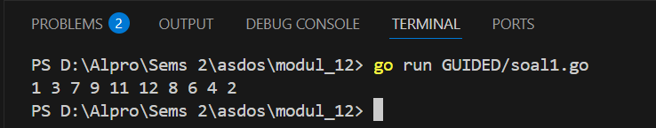
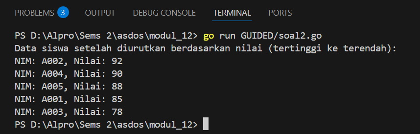
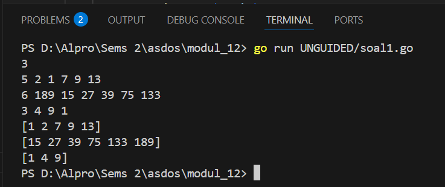
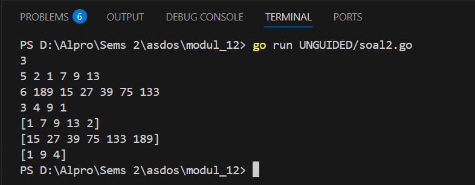
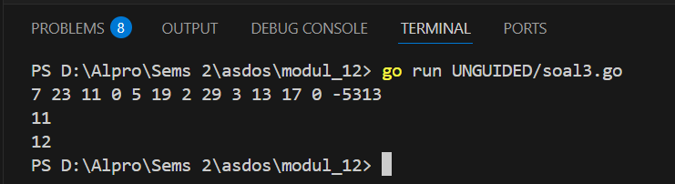

<h1 align="center">Laporan Praktikum Modul 12 & 13<br> PENGURUTAN DATA </h1>
___
<h5 align="center">Zidane Aji Noegroho - 103112430006 </h5>
### Guided
___
### Soal 1
Diberikan n bilangan bulat positif. Buat program untuk mengurutkan angka ganjil secara membesar (ascending) dan angka genap secara mengecil (descending), lalu gabungkan hasilnya dengan ganjil duluan. Gunakan selection sort dalam proses pengurutan. Masukan: Baris pertama berisi bilangan bulat n (1 ≤ n ≤ 100). Baris kedua berisi n bilangan bulat positif.

Keluaran: Satu baris berisi angka ganjil terurut membesar diikuti angka genap terurut mengecil.

Contoh Masukan: 10 12 7 3 2 9 6 8 1 11 4 Contoh Keluaran: 1 3 7 9 11 12 8 6 4 2

```go
package main

import "fmt"

func selectionSortAsc(arr []int, panjang int) {
	var temp, i, j, idxMin int
	for i = 0; i < panjang-1; i++ {
		idxMin = i
		for j = i + 1; j < panjang; j++ {
			if arr[j] < arr[idxMin] {
				idxMin = j
			}
		}
		temp = arr[idxMin]
		arr[idxMin] = arr[i]
		arr[i] = temp
	}
}

func selectionSortDesc(arr []int, panjang int) {
	var temp, i, j, idxMax int
	for i = 0; i < panjang-1; i++ {
		idxMax = i
		for j = i + 1; j < panjang; j++ {
			if arr[j] > arr[idxMax] {
				idxMax = j
			}
		}
		temp = arr[idxMax]
		arr[idxMax] = arr[i]
		arr[i] = temp
	}
}

func main() {
	n := 10
	numbers := []int{12, 7, 3, 2, 9, 6, 8, 1, 11, 4}

	var ganjil []int
	var genap []int

	for i := 0; i < n; i++ {
		if numbers[i]%2 == 1 {
			ganjil = append(ganjil, numbers[i])
		} else {
			genap = append(genap, numbers[i])
		}
	}

	selectionSortAsc(ganjil, len(ganjil))
	selectionSortDesc(genap, len(genap))

	for i := 0; i < len(ganjil); i++ {
		fmt.Print(ganjil[i], " ")
	}
	for i := 0; i < len(genap); i++ {
		fmt.Print(genap[i], " ")
	}
}
```



Program ini memisahkan angka ganjil dan genap dari sebuah daftar angka. Angka ganjil diurutkan dari kecil ke besar. Angka genap diurutkan dari besar ke kecil. Setelah itu, kedua hasilnya dicetak ke layar. Proses pengurutan menggunakan metode selection sort.

### Soal 2
Sebuah kelas memiliki sejumlah siswa yang telah mengikuti ujian. Tugas Anda adalah membuat program yang membaca nilai-nilai ujian siswa yang disimpan dalam struct berisi nim dan nilai, kemudian mengurutkan nilai-nilai tersebut dari yang tertinggi ke yang terendah menggunakan insertion sort. Masukan: Baris pertama berisi sebuah bilangan bulat n (1 ≤ n ≤ 100), yang menyatakan jumlah siswa. Baris kedua berisi n bilangan bulat, masing-masing mewakili nilai ujian siswa (0–100).Keluaran: Satu baris yang berisi nilai-nilai ujian yang sudah terurut dari yang terbesar ke yang terkecil.

Contoh Masukan: 6 75 60 90 80 100 65

Contoh Keluaran: 100 90 80 75 65 60

```go
package main

import "fmt"

type Siswa struct {
	NIM   string
	Nilai int
}

func insertionSort(data []Siswa) {
	for i := 1; i < len(data); i++ {
		key := data[i]
		j := i - 1

		for j >= 0 && data[j].Nilai < key.Nilai {
			data[j+1] = data[j]
			j--
		}
		data[j+1] = key
	}
}

func main() {
	siswa := []Siswa{
		{"A001", 85},
		{"A002", 92},
		{"A003", 78},
		{"A004", 90},
		{"A005", 88},
	}

	insertionSort(siswa)

	fmt.Println("Data siswa setelah diurutkan berdasarkan nilai (tertinggi ke terendah):")
	for _, s := range siswa {
		fmt.Printf("NIM: %s, Nilai: %d\n", s.NIM, s.Nilai)
	}
}

```



Kode ini menyimpan data beberapa siswa yang punya NIM dan nilai. Data siswa diurutkan berdasarkan nilai dari yang tertinggi ke terendah. Pengurutan dilakukan dengan algoritma insertion sort, yaitu menyisipkan satu per satu data ke posisi yang tepat. Setelah diurutkan, data siswa dicetak satu per satu ke layar. Hasil cetaknya menunjukkan NIM dan nilai siswa dari yang nilai tertinggi ke terendah.

### Unguided
___
### Soal 1
Hercules, preman terkenal seantero ibukota, memiliki kerabat di banyak daerah. Tentunya Hercules sangat suka mengunjungi semua kerabatnya itu. Diberikan masukan nomor rumah dari semua kerabatnya di suatu daerah, buatlah program rumahkerabat yang akan menyusun nomor-nomor rumah kerabatnya secara terurut membesar menggunakan algoritma selection sort. Masukan dimulai dengan sebuah integer 𝒏 (0 < n < 1000), banyaknya daerah kerabat Hercules tinggal. Isi 𝒏 baris berikutnya selalu dimulai dengan sebuah integer 𝒎 (0 < m < 1000000) yang menyatakan banyaknya rumah kerabat di daerah tersebut, diikuti dengan rangkaian bilangan bulat positif, nomor rumah para kerabat.
Keluaran terdiri dari n baris, yaitu rangkaian rumah kerabatnya terurut membesar di masing-masing daerah.

```go
package main

import "fmt"

func selectionSort(arr []int) {

	for i := 0; i < len(arr)-1; i++ {
		minIdx := i
		for j := i + 1; j < len(arr); j++ {
			if arr[j] < arr[minIdx] {
				minIdx = j
			}
		}
		arr[i], arr[minIdx] = arr[minIdx], arr[i]
	}
}

func inputan() {
	var n int
	var data [][]int

	fmt.Scanln(&n)

	for i := 0; i < n; i++ {
		var baris []int
		var jumlahData int

		fmt.Scan(&jumlahData)

		for j := 0; j < jumlahData; j++ {
			var num int
			fmt.Scan(&num)
			baris = append(baris, num)
		}

		selectionSort(baris)

		data = append(data, baris)
	}

	for i := range data {
		fmt.Println(data[i])
	}
}

func main() {
	inputan()
}
```



program ini membaca data dari beberapa daerah, di mana tiap daerah memiliki sejumlah nomor rumah. Pertama, program meminta jumlah daerah, lalu untuk setiap daerah, meminta jumlah nomor rumah dan nilainya. Nomor-nomor rumah diurutkan satu per satu menggunakan algoritma selection sort, dari yang terkecil ke terbesar. Semua data yang sudah terurut disimpan, lalu dicetak satu baris per daerah. Setiap baris menunjukkan nomor rumah yang sudah tersusun rapi.

### Soal 2
Belakangan diketahui ternyata Hercules itu tidak berani menyeberang jalan, maka selalu diusahakan agar hanya menyeberang jalan sesedikit mungkin, hanya diujung jalan. Karena nomor rumah sisi kiri jalan selalu ganjil dan sisi kanan jalan selalu genap, maka buatlah program kerabat dekat yang akan menampilkan nomor rumah mulai dari nomor yang ganjil lebih dulu terurut membesar dan kemudian menampilkan nomor rumah dengan nomor genap terurut mengecil.

Format Masukan masih persis sama seperti sebelumnya.

Keluaran terdiri dari n baris, yaitu rangkaian rumah kerabatnya terurut membesar untuk nomor ganjil, diikuti dengan terurut mengecil untuk nomor genap, di masing-masing daerah.

```go
package main

import "fmt"

func pengurutan(arr []int) {
	dataUrut := 0

	for i := 0; i < len(arr); i++ {
		if arr[i]%2 != 0 {
			arr[i], arr[dataUrut] = arr[dataUrut], arr[i]
			dataUrut++
		}
	}

	for i := 0; i < dataUrut-1; i++ {
		dataMinimum := i
		for j := i + 1; j < dataUrut; j++ {
			if arr[j] < arr[dataMinimum] {
				dataMinimum = j
			}
		}
		arr[i], arr[dataMinimum] = arr[dataMinimum], arr[i]
	}

	for i := dataUrut; i < len(arr)-1; i++ {
		dataMaksimum := i
		for j := i + 1; j < len(arr); j++ {
			if arr[j] > arr[dataMaksimum] {
				dataMaksimum = j
			}
		}
		arr[i], arr[dataMaksimum] = arr[dataMaksimum], arr[i]
	}
}

func inputan() {

	var n int
	var data [][]int

	fmt.Scanln(&n)

	for i := 0; i < n; i++ {
		var baris []int
		var jumlahData int

		fmt.Scan(&jumlahData)

		for j := 0; j < jumlahData; j++ {
			var num int

			fmt.Scan(&num)
			baris = append(baris, num)
		}

		pengurutan(baris)

		data = append(data, baris)
	}

	for i := range data {
		fmt.Println(data[i])
	}
}

func main() {
	inputan()
}
```



program ini membaca beberapa baris data berisi nomor rumah. Untuk setiap baris, nomor ganjil akan dipindahkan ke depan dan diurutkan membesar. Nomor genap diletakkan di belakang dan diurutkan mengecil. Proses pengurutan dilakukan manual dengan algoritma selection sort. Hasil akhir setiap baris ditampilkan ke layar. Setiap baris menunjukkan nomor rumah yang sudah dipisah dan diurutkan sesuai aturan.

### Soal 3
Kompetisi pemrograman yang baru saja berlalu diikuti oleh 17 tim dari berbagai perguruan tinggi ternama. Dalam kompetisi tersebut, setiap tim berlomba untuk menyelesaikan sebanyak mungkin problem yang diberikan. Dari 13 problem yang diberikan, ada satu problem yang menarik. Problem tersebut mudah dipahami, hampir semua tim mencoba untuk menyelesaikannya, tetapi hanya 3 tim yang berhasil. Apa sih problemnya?

"Median adalah nilai tengah dari suatu koleksi data yang sudah terurut. Jika jumlah data genap, maka nilai median adalah rerata dari kedua nilai tengahnya. Pada problem ini, semua data merupakan bilangan bulat positif, dan karenanya rerata nilai tengah dibulatkan ke bawah."
Buatlah program median yang mencetak nilai median terhadap seluruh data yang sudah terbaca, jika data yang dibaca saat itu adalah 0.

Masukan berbentuk rangkaian bilangan bulat. Masukan tidak akan berisi lebih dari 1000000 data, tidak termasuk bilangan 0. Data 0 merupakan tanda bahwa median harus dicetak, tidak termasuk data yang dicari mediannya. Data masukan diakhiri dengan bilangan bulat -5313.

Keluaran adalah median yang diminta, satu data per baris.

```go
package main

import (
	"fmt"
)

func cetakMedian(data []int) {
	if len(data) == 0 {
		fmt.Println(0)
		return
	}

	salinan := make([]int, len(data))
	copy(salinan, data)

	for i := 1; i < len(salinan); i++ {
		key := salinan[i]
		j := i - 1
		for j >= 0 && salinan[j] > key {
			salinan[j+1] = salinan[j]
			j--
		}
		salinan[j+1] = key
	}

	mid := len(salinan) / 2
	if len(salinan)%2 == 1 {
		fmt.Println(salinan[mid])
	} else {
		fmt.Println((salinan[mid-1] + salinan[mid]) / 2)
	}
}

func prosesInput() {
	var input int
	var data []int

	for {
		fmt.Scan(&input)

		if input == -5313 {
			break
		} else if input == 0 {
			cetakMedian(data)
		} else {
			data = append(data, input)
		}
	}
}

func main() {
	prosesInput()
}
```



Program ini membaca deretan bilangan bulat dari user, lalu mencetak nilai median setiap kali input 0 dimasukkan. Data disalin ke slice baru dan diurutkan menggunakan insertion sort. Median dihitung dari data yang sudah diurutkan, lalu ditampilkan. Jika jumlah data ganjil, median adalah nilai tengah, sedangkan jika genap, median adalah rata-rata dua nilai tengah yang dibulatkan ke bawah. Program berhenti saat input -5313 dimasukkan.

### Soal 4
Buatlah sebuah program yang digunakan untuk membaca data integer seperti contoh yang diberikan di bawah ini, kemudian diurutkan (menggunakan metoda insertion sort), dan memeriksa apakah data yang terurut berjarak sama terhadap data sebelumnya.
Masukan terdiri dari sekumpulan bilangan bulat yang diakhiri oleh bilangan negatif. Hanya bilangan non negatif saja yang disimpan ke dalam array.
Keluaran terdiri dari dua baris. Baris pertama adalah isi dari array setelah dilakukan pengurutan, sedangkan baris kedua adalah status jarak setiap bilangan yang ada di dalam array. "Data berjarak x" atau "data berjarak tidak tetap".

```go
package main

import (
	"fmt"
)

func insertionSort(data []int) {
	for i := 1; i < len(data); i++ {
		key := data[i]
		j := i - 1
		for j >= 0 && data[j] > key {
			data[j+1] = data[j]
			j--
		}
		data[j+1] = key
	}
}

func cekJarak(data []int) string {
	if len(data) < 2 {
		return "Data berjarak tidak tetap"
	}

	jarak := data[1] - data[0]
	for i := 2; i < len(data); i++ {
		if data[i]-data[i-1] != jarak {
			return "Data berjarak tidak tetap"
		}
	}

	return fmt.Sprintf("Data berjarak %d", jarak)
}

func main() {
	var input int
	var data []int

	for {
		fmt.Scan(&input)
		if input < 0 {
			break
		}
		data = append(data, input)
	}

	insertionSort(data)

	for _, val := range data {
		fmt.Printf("%d ", val)
	}
	fmt.Println()
	fmt.Println(cekJarak(data))
}
```


Program ini membaca deretan bilangan bulat positif dari pengguna sampai ditemukan angka negatif. Semua bilangan yang sudah dimasukkan akan diurutkan menggunakan algoritma insertion sort, yaitu cara pengurutan dengan membandingkan dan menyisipkan angka ke posisi yang sesuai. Setelah data diurutkan, program akan mencetak data tersebut, lalu memeriksa apakah selisih antara satu angka dengan angka setelahnya selalu sama. Jika selisihnya sama, maka program akan mencetak keterangan “Data berjarak x” sesuai dengan selisihnya, dan jika tidak sama maka akan mencetak “Data berjarak tidak tetap”.

### Soal 5
Sebuah program perpustakaan digunakan untuk mengelola data buku di dalam suatu perpustakaan. Misalnya terdefinisi struct dan array seperti berikut ini: const nMax : integer = 7919 type Buku = < id, judul, penulis, penerbit : string eksemplar, tahun, rating : integer > type DaftarBuku = array [ 1..nMax] of Buku Pustaka : DaftarBuku nPustaka: integer
Masukan terdiri dari beberapa baris. Baris pertama adalah bilangan bulat N yang menyatakan banyaknya data buku yang ada di dalam perpustakaan. N baris berikutnya, masing-masingnya adalah data buku sesuai dengan atribut atau field pada struct. Baris terakhir adalah bilangan bulat yang menyatakan rating buku yang akan dicari.
Keluaran terdiri dari beberapa baris. Baris pertama adalah data buku terfavorit, baris kedua adalah lima judul buku dengan rating tertinggi, selanjutnya baris terakhir adalah data buku yang dicari sesuai rating yang diberikan pada masukan baris terakhir.

```go
package main

import "fmt"

const nMax = 7919

type Buku struct {
	id, judul, penulis, penerbit string
	eksemplar, tahun, rating     int
}

type DaftarBuku [nMax]Buku

func daftarkanBuku(pustaka *DaftarBuku, n *int) {
	fmt.Scan(n)
	for i := 0; i < *n; i++ {
		fmt.Scan(
			&(*pustaka)[i].id,
			&(*pustaka)[i].judul,
			&(*pustaka)[i].penulis,
			&(*pustaka)[i].penerbit,
			&(*pustaka)[i].eksemplar,
			&(*pustaka)[i].tahun,
			&(*pustaka)[i].rating,
		)
	}
}

func urutBuku(pustaka *DaftarBuku, n int) {
	for i := 1; i < n; i++ {
		temp := (*pustaka)[i]
		j := i - 1
		for j >= 0 && (*pustaka)[j].rating < temp.rating {
			(*pustaka)[j+1] = (*pustaka)[j]
			j--
		}
		(*pustaka)[j+1] = temp
	}
}

func cetakTerfavorit(pustaka DaftarBuku, n int) {
	fmt.Println("\nBuku terfavorit:")
	fmt.Println(pustaka[0].judul, pustaka[0].penulis, pustaka[0].penerbit, pustaka[0].tahun, pustaka[0].rating)
}

func cetak5Terbaru(pustaka DaftarBuku, n int) {
	if n > 5 {
		n = 5
	}

	fmt.Println("\n5 Judul Buku dengan rating tertinggi:")
	for i := 0; i < n; i++ {
		fmt.Printf("%d. %s\n", i+1, pustaka[i].judul)
	}
}

func cariBuku(pustaka DaftarBuku, n, r int) {
	kiri := 0
	kanan := n - 1
	ditemukan := false

	for kiri <= kanan {
		tengah := (kiri + kanan) / 2
		if pustaka[tengah].rating == r {
			fmt.Println("\nBuku dengan rating", r, "ditemukan:")
			fmt.Println(pustaka[tengah].judul, pustaka[tengah].penulis, pustaka[tengah].penerbit, pustaka[tengah].tahun, pustaka[tengah].eksemplar, pustaka[tengah].rating)
			ditemukan = true
			break
		} else if pustaka[tengah].rating < r {
			kanan = tengah - 1
		} else {
			kiri = tengah + 1
		}
	}

	if !ditemukan {
		fmt.Println("Tidak ada buku dengan rating seperti itu")
	}
}

func main() {
	var pustaka DaftarBuku
	var nPustaka, ratingCari int

	daftarkanBuku(&pustaka, &nPustaka)
	fmt.Scan(&ratingCari)
	urutBuku(&pustaka, nPustaka)
	cetakTerfavorit(pustaka, nPustaka)
	cetak5Terbaru(pustaka, nPustaka)
	cariBuku(pustaka, nPustaka, ratingCari)
}

```


Program ini digunakan untuk mengelola data buku dalam suatu perpustakaan. Pertama, pengguna akan diminta untuk memasukkan jumlah data buku dan detail setiap buku, seperti ID, judul, penulis, penerbit, eksemplar, tahun, dan rating. Setelah semua data buku dimasukkan, program akan mengurutkan buku berdasarkan rating dari yang tertinggi ke terendah menggunakan metode insertion sort. Kemudian, program akan mencetak buku dengan rating tertinggi sebagai buku terfavorit, menampilkan lima buku teratas berdasarkan rating, dan mencari buku berdasarkan rating yang diinput pengguna menggunakan metode pencarian biner. Jika buku dengan rating tersebut ditemukan, data buku akan ditampilkan, jika tidak, akan muncul pesan bahwa buku dengan rating tersebut tidak ditemukan.