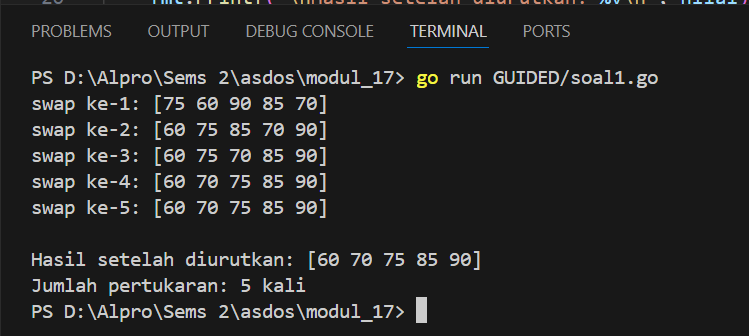
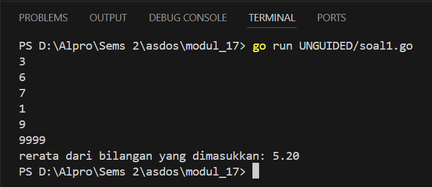
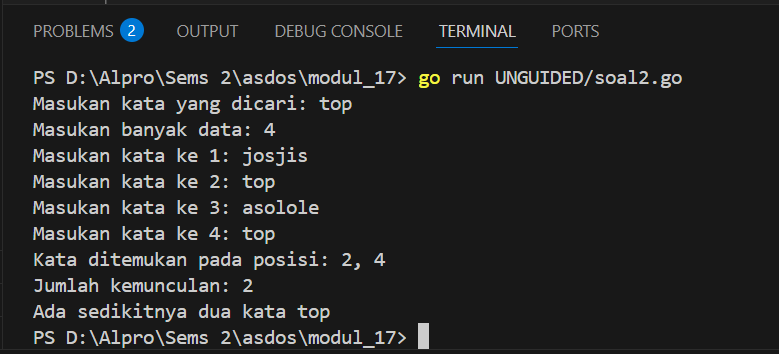
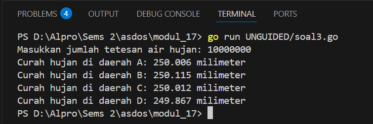
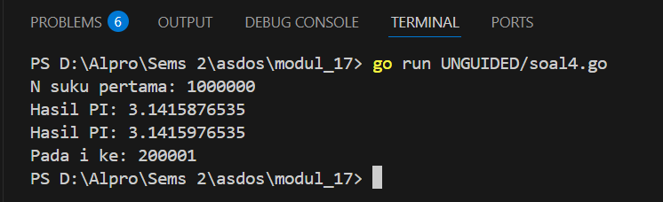
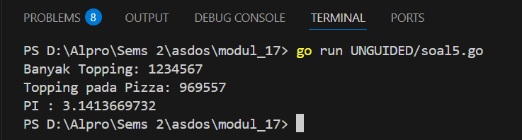

<h1 align="center">Laporan Praktikum Modul 11 <br> PENCARIAN NILAI ACAK PADA HIMPUNAN DATA </h1>
___
<h5 align="center">Zidane Aji Noegroho - 103112430006 </h5>
### Guided
___
### Soal 1

```go
package main

import "fmt"

func main() {
	nilai := []int{75, 60, 90, 85, 70}
	n := len(nilai)
	jumlahPertukaran := 0

	for i := 0; i < n; i++ {
		fmt.Printf("swap ke-%d: %v\n", i+1, nilai)
		for j := 0; j < n-i-1; j++ {
			if nilai[j] > nilai[j+1] {
				nilai[j], nilai[j+1] = nilai[j+1], nilai[j]
				jumlahPertukaran++
			}
		}
	}

	fmt.Printf("\nHasil setelah diurutkan: %v\n", nilai)
	fmt.Printf("Jumlah pertukaran: %d kali\n", jumlahPertukaran)
}
```



Program ini digunakan untuk mengurutkan daftar angka dari yang terkecil ke yang terbesar. Pertama, program menyimpan lima angka dalam sebuah daftar. Kemudian, angka-angka tersebut dibandingkan satu per satu. Jika ada angka yang lebih besar berada di depan angka yang lebih kecil, maka keduanya akan ditukar. Proses ini diulang beberapa kali sampai semua angka berada dalam urutan yang benar. Selama proses pengurutan, program juga menampilkan kondisi angka-angka setelah setiap langkah. Setelah semua selesai, program akan mencetak daftar angka yang sudah terurut dan memberitahu berapa kali pertukaran angka terjadi selama proses tersebut.

### Unguided
___
### Soal 1
Diberikan sejumlah bilangan real yang diakhiri dengan marker 9999, cari rerata dari bilangan-bilangan tersebut.

```go
package main

import "fmt"

func main() {
	var jumlah, total, bilangan int

	for {
		fmt.Scan(&bilangan)

		if bilangan == 9999 {
			break
		}

		jumlah += bilangan
		total++
	}

	rerata := float64(jumlah) / float64(total)
	fmt.Printf("rerata dari bilangan yang dimasukkan: %.2f\n", rerata)
}
```



Program ini membaca sejumlah bilangan bulat dari user satu per satu. Setiap bilangan akan dijumlahkan dan dihitung banyaknya sampai user memasukkan angka 9999 sebagai tanda berhenti. Setelah itu, program menghitung rata-rata dari semua bilangan yang dimasukkan (tidak termasuk 9999) dan menampilkannya dengan dua angka di belakang koma.

### Soal 2
Diberikan string x dan n buah string. x adalah data pertama yang dibaca, n adalah data bilangan yang dibaca kedua, dan n data berikutnya adalah data string. Buat algoritma untuk menjawab pertanyaan berikut: a. Apakah string x ada dalam kumpulan n data string tersebut? b. Pada posisi ke berapa string x tersebut ditemukan? c. Ada berapakah string x dalam kumpulan n data string tersebut? d. Adakah sedikitnya dua string x dalam n data string tersebut?

```go
package main

import "fmt"

func pencarianKata(target string, banyakData int) {

	var posisi []int

	for i := 1; i <= banyakData; i++ {
		var input string
		fmt.Print("Masukan kata ke ", i, ": ")
		fmt.Scanln(&input)
		if input == target {
			posisi = append(posisi, i)
		}
	}

	if len(posisi) > 0 {
		fmt.Print("Kata ditemukan pada posisi: ")
		for i, p := range posisi {
			if i > 0 {
				fmt.Print(", ")
			}
			fmt.Print(p)
		}
		fmt.Println("\nJumlah kemunculan:", len(posisi))
		if len(posisi) >= 2 {
			fmt.Println("Ada sedikitnya dua kata", target)
		} else {
			fmt.Println("Hanya ada satu string", target)
		}
	} else {
		fmt.Println("Kata tidak ditemukan.")
	}
}

func main() {
	var target string
	var banyakData int

	fmt.Print("Masukan kata yang dicari: ")
	fmt.Scanln(&target)

	fmt.Print("Masukan banyak data: ")
	fmt.Scanln(&banyakData)

	pencarianKata(target, banyakData)
}
```



Program ini mencari sebuah kata tertentu dari sekumpulan data yang dimasukkan oleh user. Pertama, user diminta memasukkan kata yang ingin dicari dan jumlah total data yang akan dimasukkan. Lalu, program meminta user untuk mengetikkan kata satu per satu sebanyak jumlah yang telah ditentukan. Setiap kata dibandingkan dengan kata target. Jika cocok, posisi kata tersebut disimpan. Setelah semua data dimasukkan, program akan mencetak posisi kemunculan kata target, jumlah kemunculannya, dan memberi tahu apakah kata itu muncul lebih dari sekali atau hanya satu kali. Jika kata tidak ditemukan sama sekali, program akan memberi tahu bahwa kata tersebut tidak ada.

### Soal 3
Empat daerah A, B, C, dan D yang berdekatan ingin mengukur curah hujan. Keempat daerah tersebut digambarkan pada bidang berikut: Misal curah hujan dihitung berdasarkan banyaknya tetesan air hujan. Setiap tetesan berukuran 0.0001 ml curah hujan. Tetesan air hujan turun secara acak dari titik (0,0) sampai (1,1). Jika diterima input yang menyatakan banyaknya tetesan air hujan. Tentukan curah hujan untuk keempat daerah tersebut.

Buatlah program yang menerima input berupa banyaknya tetesan air hujan. Kemudian buat koordinat/titik (x, y) secara acak dengan menggunakan fungsi rand.Float64(). Hitung dan tampilkan banyaknya tetesan yang jatuh pada daerah A, B, C dan D. Konversikan satu tetesan berukuran 0.0001 milimeter.

	Catatan: Lihat lampiran untuk informasi menggunakan paket math/rand untuk menggunakan rand.Float64() yang menghasilkan bilangan riil acak 0..1

```go
package main

import (
	"fmt"
	"math/rand"
)

func banyakTetesan() int {
	var jumlahTetesanAir int

	fmt.Print("Masukkan jumlah tetesan air hujan: ")
	fmt.Scan(&jumlahTetesanAir)
	return jumlahTetesanAir
}

func tetesanHujan(jumlahTetesanAir int) (int, int, int, int) {
	var daerahA, daerahB, daerahC, daerahD int

	for i := 0; i < jumlahTetesanAir; i++ {
		x := rand.Float64()
		y := rand.Float64()

		if x < 0.5 && y < 0.5 {
			daerahA++
		} else if x >= 0.5 && y < 0.5 {
			daerahB++
		} else if x < 0.5 && y >= 0.5 {
			daerahC++
		} else {
			daerahD++
		}
	}
	return daerahA, daerahB, daerahC, daerahD
}

func hitungCurahHujan(daerahA, daerahB, daerahC, daerahD int, ukuranTetesan float64) (float64, float64, float64, float64) {

	curahHujanDaerahA := float64(daerahA) * ukuranTetesan
	curahHujanDaerahB := float64(daerahB) * ukuranTetesan
	curahHujanDaerahC := float64(daerahC) * ukuranTetesan
	curahHujanDaerahD := float64(daerahD) * ukuranTetesan
	return curahHujanDaerahA, curahHujanDaerahB, curahHujanDaerahC, curahHujanDaerahD
}

func tampilkanHasil(curahHujanDaerahA, curahHujanDaerahB, curahHujanDaerahC, curahHujanDaerahD float64) {

	fmt.Printf("Curah hujan di daerah A: %.3f milimeter\n", curahHujanDaerahA)
	fmt.Printf("Curah hujan di daerah B: %.3f milimeter\n", curahHujanDaerahB)
	fmt.Printf("Curah hujan di daerah C: %.3f milimeter\n", curahHujanDaerahC)
	fmt.Printf("Curah hujan di daerah D: %.3f milimeter\n", curahHujanDaerahD)
}

func main() {

	ukuranTetesan := 0.0001

	jumlahTetesanAir := banyakTetesan()
	daerahA, daerahB, daerahC, daerahD := tetesanHujan(jumlahTetesanAir)
	curahHujanDaerahA, curahHujanDaerahB, curahHujanDaerahC, curahHujanDaerahD := hitungCurahHujan(daerahA, daerahB, daerahC, daerahD, ukuranTetesan)
	tampilkanHasil(curahHujanDaerahA, curahHujanDaerahB, curahHujanDaerahC, curahHujanDaerahD)

}
```



Program ini digunakan untuk mensimulasikan tetesan air hujan yang jatuh secara acak ke sebuah bidang datar yang dibagi menjadi empat daerah: A, B, C, dan D. User diminta memasukkan jumlah tetesan hujan. Setiap tetesan diberikan koordinat acak antara 0 dan 1 pada sumbu x dan y. Berdasarkan posisi koordinat, tetesan itu dihitung masuk ke salah satu dari empat daerah. Setelah semua tetesan dikategorikan, program menghitung curah hujan di tiap daerah dengan mengalikan jumlah tetesan dengan ukuran standar satu tetes. Terakhir, program menampilkan hasil curah hujan untuk masing-masing daerah dalam satuan milimeter.

### Soal 4
Berdasarkan formula Leibniz, nilai π dapat dinyatakan sebagai deret harmonik ganti sebagai berikut: 1−13+15−17+19−⋯=𝜋4 Suku ke-i dinyatakan sebagai 𝑆𝑖 dan jumlah deret adalah 𝑆. Apabila diketahui suku pertama 𝑆1=1, suku kedua 𝑆2=−13 . Temukan rumus untuk suku ke-𝒊 atau 𝑆𝑖. Berdasarkan rumus tersebut, buatlah program yang menghitung 𝑆 untuk 1000000 suku pertama. Perhatikan contoh sesi interaksi program di bawah ini (teks bergaris bawah adalah input/read):

Setelah jalan, modifikasi program tersebut agar menyimpan nilai dua suku yang bersebelahan, 𝑆𝑖 dan 𝑆𝑖+1. Buatlah agar program tersebut sekarang berhenti apabila selisih dari kedua suku tersebut tidak lebih dari 0.00001. Perhatikan contoh sesi interaksi program di bawah ini (teks bergaris bawah adalah input/read):

```go
package main

import (
	"fmt"
	"math"
)

func bulatkanAngka(angka float64) float64 {
	return math.Trunc(angka*1e10) / 1e10
}

func estimasiPI(jumlahSuku int) (float64, float64, int) {
	hasil, sebelumnya := 0.0, 0.0

	for indeks, tanda := 0, 1.0; indeks < jumlahSuku; indeks, tanda = indeks+1, -tanda {
		hasil += tanda / float64(2*indeks+1)
		sekarang := hasil * 4

		if indeks > 0 && math.Abs(sekarang-sebelumnya) < 0.00001 {
			return bulatkanAngka(sebelumnya), bulatkanAngka(sekarang), indeks + 1
		}
		sebelumnya = sekarang
	}
	return bulatkanAngka(sebelumnya), bulatkanAngka(sebelumnya), jumlahSuku
}

func main() {
	var banyakSuku int

	fmt.Print("N suku pertama: ")
	fmt.Scan(&banyakSuku)

	piAwal, piAkhir, iterasi := estimasiPI(banyakSuku)

	fmt.Printf("Hasil PI: %.10f\n", piAwal)
	fmt.Printf("Hasil PI: %.10f\n", piAkhir)
	fmt.Printf("Pada i ke: %d\n", iterasi)
}
```



Program ini bertujuan untuk menghitung nilai π (pi) secara mendekati menggunakan deret matematika (dikenal sebagai deret Leibniz). Pertama, user diminta memasukkan berapa banyak suku yang ingin dihitung. Setiap suku dalam deret ini dihitung secara bergantian positif dan negatif, lalu dijumlahkan. Hasil penjumlahan dikalikan dengan 4 untuk mendapatkan nilai pendekatan dari π. Selama perhitungan, program juga memeriksa apakah perbedaan hasil saat ini dan sebelumnya sudah cukup kecil, yang artinya pendekatan sudah cukup akurat. Jika iya, program akan berhenti lebih cepat dan menampilkan dua hasil π yang hampir sama serta di iterasi ke berapa pendekatan itu tercapai. Angka π yang ditampilkan juga dibulatkan hingga 10 angka di belakang koma.

### Soal 5
Monti bekerja pada sebuah kedai pizza, saking ramainya kedai tersebut membuat Monti tidak ada waktu untuk bersantai. Suatu ketika saat sedang menaburkan topping pada pizza yang diletakkan pada wadah berbentuk persegi, terpikirkan oleh Monti cara menghitung berapa banyak topping yang dia butuhkan, dan cara menghitung nilai 𝝅.

Ilustrasi seperti gambar yang diberikan di bawah, topping adalah lingkaran-lingkaran kecil. Ada yang tepat berada di atas pizza, dan ada yang jatuh di dalam kotak tetapi berada di luar pizza. Apabila luas pizza yang memiliki radius r adalah 𝐿𝑢𝑎𝑠𝑃𝑖𝑧𝑧𝑎=𝜋𝑟2 dan luas wadah pizza yang memiliki panjang sisi 𝑑=2𝑟 adalah 𝐿𝑢𝑎𝑠𝑊𝑎𝑑𝑎ℎ=𝑑2=4𝑟2, maka diperoleh perbandingan luas kedua bidang tersebut 𝐿𝑢𝑎𝑠𝑃𝑖𝑧𝑧𝑎𝐿𝑢𝑎𝑠𝑊𝑎𝑑𝑎ℎ=𝜋𝑟24𝑟2=𝜋4

Persamaan lingkaran adalah (𝑥−𝑥𝑐)2+(𝑦−𝑦𝑐)2=𝑟2 dengan titik pusat lingkaran adalah (𝑥𝑐,𝑦𝑐). Suatu titik sembarang (𝑥,𝑦) dikatakan berada di dalam lingkaran apabila memenuhi ketidaksamaan: (𝑥−𝑥𝑐)2+(𝑦−𝑦𝑐)2≤𝑟2

Pada ilustrasi topping berbentuk bulat kecil merah dan biru pada gambar adalah titik-titik (𝑥,𝑦) acak pada sebuah wadah yang berisi pizza. Dengan jumlah yang sangat banyak dan ditaburkan merata (secara acak), maka kita bisa mengetahui berapa banyak titik/topping yang berada tepat di dalam pizza menggunakan ketidaksamaan di atas.

Buatlah program yang menerima input berupa banyaknya topping yang akan ditaburkan, kemudian buat titik acak (𝑥,𝑦) dari bilangan acak riil pada kisaran nilai 0 hingga 1 sebanyak topping yang diberikan. Hitung dan tampilkan berapa banyak topping yang jatuh tepat di atas pizza.

Titik pusat pizza adalah (0.5, 0.5) dan jari-jari pizza adalah 0.5 satuan wadah. Perhatikan contoh sesi interaksi program di bawah ini (teks bergaris bawah adalah input/read):

Apabila topping yang ditaburkan oleh Monti secara merata berjumlah yang sangat banyak, maka topping akan menutupi keseluruhan wadah pizza. Luas Pizza sebanding dengan topping yang berada pada pizza, sedangkan Luas Wadah sebanding dengan banyaknya topping yang ditaburkan. Dengan menggunakan rumus perbandingan luas yang diberikan di atas, maka nilai konstanta 𝜋 dapat dihitung.

Modifikasi program di atas sehingga dapat menghitung dan menampilkan nilai konstanta π. Perhatikan contoh sesi interaksi program di bawah ini (teks bergaris bawah adalah input/read):

```go
package main

import (
	"fmt"
	"math/rand"
)

func ambilJumlahTopping() int {
	var jumlahTopping int
	fmt.Print("Banyak Topping: ")
	fmt.Scan(&jumlahTopping)
	return jumlahTopping
}

func adaDiDalamPizza(x, y, pusatX, pusatY, jariJari float64) bool {
	return (x-pusatX)*(x-pusatX)+(y-pusatY)*(y-pusatY) <= jariJari*jariJari
}

func hitungToppingDalamPizza(jumlahTopping int, pusatX, pusatY, jariJari float64) int {
	jumlahDalamPizza := 0
	for i := 0; i < jumlahTopping; i++ {
		xAcak := rand.Float64()
		yAcak := rand.Float64()

		if adaDiDalamPizza(xAcak, yAcak, pusatX, pusatY, jariJari) {
			jumlahDalamPizza++
		}
	}
	return jumlahDalamPizza
}

func estimasiPi(jumlahTopping, toppingDalamPizza int) float64 {
	return float64(toppingDalamPizza) / float64(jumlahTopping) * 4
}

func main() {
	jumlahTopping := ambilJumlahTopping()
	pusatX, pusatY, jariJari := 0.5, 0.5, 0.5
	jumlahDalamPizza := hitungToppingDalamPizza(jumlahTopping, pusatX, pusatY, jariJari)
	fmt.Printf("Topping pada Pizza: %d\n", jumlahDalamPizza)
	pi := estimasiPi(jumlahTopping, jumlahDalamPizza)
	fmt.Printf("PI : %.10f\n", pi)
}
```



Program ini digunakan untuk memperkirakan nilai π (pi) menggunakan simulasi sederhana berdasarkan jumlah topping pizza. Pertama, program meminta user untuk memasukkan berapa banyak topping yang ingin ditaburkan. Setiap topping dianggap sebagai sebuah titik acak di dalam wadah berbentuk kotak. Program kemudian mengecek apakah setiap titik tersebut jatuh di dalam area lingkaran (pizza) yang terletak di tengah kotak. Jika titik berada di dalam lingkaran, maka dianggap sebagai topping yang benar-benar mengenai pizza. Setelah semua titik diperiksa, program menghitung berapa banyak yang masuk ke dalam pizza dan menggunakan rasio itu untuk memperkirakan nilai π. Hasil akhirnya adalah jumlah topping yang mengenai pizza dan nilai π yang diperkirakan.