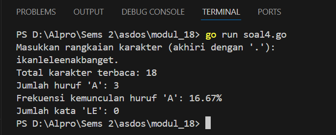

<h1 align="center">Laporan Praktikum Modul 18 <br> Mesin Abstrak </h1>
___
<h5 align="center">Zidane Aji Noegroho - 103112430006 </h5>
### Unguided
___
### Soal 4
Implementasi mesin abstrak karakter yang bekerja terhadap untaian karakter (yang diakhiri dengan penanda titik (".") dan mempunyai sejumlah operasi dasar. 
a) Operasi dasar mesin karakter: ➢ Prosedur start(); yang menyiapkan mesin karakter di awal rangkaian karakter. ➢ Prosedur maju(); yang memajukan pembaca ke posisi karakter berikutnya. ➢ Fungsi eop(); yang mengembalikan nilai true apabila sudah mencapai akhir rangkaian, sampai ke penanda titik ("."). ➢ Fungsi cc(); yang mengembalikan karakter yang sedang terbaca, atau berada pada posisi pembacaan mesin.

b) Dengan operasi dasar di atas buat algoritma untuk: ➢ Membaca seluruh karakter yang diberikan ke mesin karakter tersebut. ➢ Menghitung berapa banyak karakter yang terbaca. ➢ Menghitung ada berapa huruf "A" yang terbaca. ➢ Menghitung frekuensi kemunculan huruf "A" terhadap seluruh karakter terbaca. ➢ Menghitung ada berapa kata "LE" (pasangan berturutan huruf "L" dan "E") yang terbaca.

```go
package main

import (
	"fmt"
)

var input string
var current int

func start(inputStr string) {
	input = inputStr
	current = 0
}

func maju() {
	if current < len(input) {
		current++
	}
}

func eop() bool {
	return current >= len(input) || input[current] == '.'
}

func cc() byte {
	if eop() {
		return 0
	}
	return input[current]
}

func main() {
	fmt.Println("Masukkan rangkaian karakter (akhiri dengan '.'): ")
	fmt.Scanln(&input)

	start(input)

	totalCharacters := 0
	countA := 0
	countLE := 0

	for !eop() {
		char := cc()
		totalCharacters++

		if char == 'A' || char == 'a' {
			countA++
		}

		if current < len(input)-1 && char == 'L' && input[current+1] == 'E' {
			countLE++
		}

		maju()
	}

	if totalCharacters > 0 {
		frequencyA := float64(countA) / float64(totalCharacters) * 100
		fmt.Printf("Total karakter terbaca: %d\n", totalCharacters)
		fmt.Printf("Jumlah huruf 'A': %d\n", countA)
		fmt.Printf("Frekuensi kemunculan huruf 'A': %.2f%%\n", frequencyA)
		fmt.Printf("Jumlah kata 'LE': %d\n", countLE)
	} else {
		fmt.Println("Tidak ada karakter yang terbaca.")
	}
}

```



Program ini membaca sebuah rangkaian karakter dari user yang diakhiri dengan tanda titik (.). Setelah user memasukkan teks, program memproses setiap karakter satu per satu. Selama pemrosesan, program menghitung total karakter yang dibaca, jumlah huruf 'A' (baik huruf besar maupun kecil), dan jumlah pasangan huruf 'L' yang diikuti oleh huruf 'E' (menandai kemunculan kata "LE"). Setelah seluruh karakter diproses, program menampilkan total karakter yang terbaca, jumlah huruf 'A', frekuensi kemunculan huruf 'A' dalam bentuk persentase, dan jumlah kemunculan pasangan huruf "LE". Jika tidak ada karakter yang terbaca sebelum tanda titik, program memberi tahu bahwa tidak ada karakter yang diproses.