<h1 align="center">Laporan Praktikum Modul 2 <br> REVIEW PENGENALAN PEMROGRAMAN </h1>
___
<h5 align="center">Zidane Aji Noegroho - 103112430006 </h5>
### Unguided
___
### Soal Latihan 2A
### Soal 1

Telusuri program berikut dengan cara mengkompilasi dan mengeksekusi program. Silakan masukan data yang sesuai sebanyak yang diminta program. Perhatikan keluaran yang diperoleh. Coba terangkan apa sebenarnya yang dilakukan program tersebut?

```go
package main

import "fmt"

func main() {

    var (
        satu, dua, tiga string
        temp            string
    )
  
    fmt.Print("Masukan input string: ")
    fmt.Scanln(&satu)
    fmt.Print("Masukan input string: ")
    fmt.Scanln(&dua)
    fmt.Print("Masukan input string: ")
    fmt.Scanln(&tiga)
    fmt.Println("Output awal = " + satu + " " + dua + " " + tiga)
    temp = satu
    satu = dua
    dua = tiga
    tiga = temp
    fmt.Println("Output akhir = " + satu + " " + dua + " " + tiga)

}
```

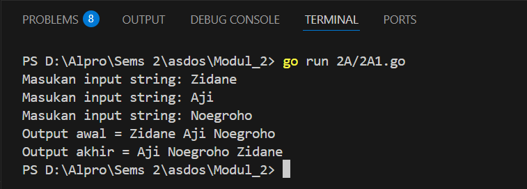
Program ini meminta pengguna memasukkan tiga kata, lalu menukar urutannya secara melingkar. Misalnya, jika input awal adalah "A B C", setelah pertukaran akan menjadi "B C A". Pertukaran dilakukan dengan menggunakan variabel tambahan (temp) untuk menyimpan sementara nilai awal sebelum dipindahkan.

### Soal 2

Tahun kabisat adalah tahun yang habis dibagi 400 atau habis dibagi 4 tetapi tidak habis dibagi 100. Buatlah sebuah program yang menerima input sebuah bilangan bulat dan memeriksa apakah bilangan tersebut merupakan tahun kabisat (true) atau bukan (false).

```go
package main

import "fmt"

func main() {

    var cekTahun int

    fmt.Print("Masukkan tahun: ")
    fmt.Scan(&cekTahun)

    kabisat := (cekTahun%400 == 0) || (cekTahun%4 == 0 && cekTahun%100 != 0)

    fmt.Println("Kabisat:", kabisat)

}
```

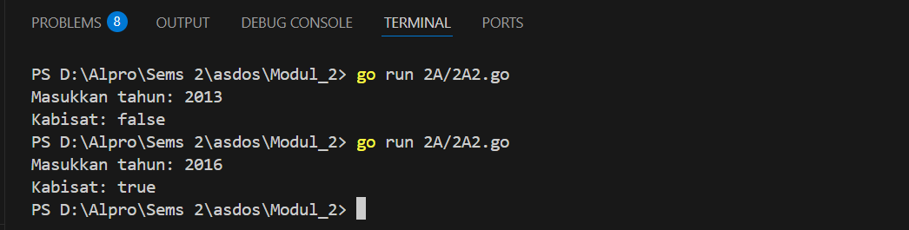

Program ini mengecek apakah suatu tahun adalah tahun kabisat atau tidak. Pengguna memasukkan tahun, lalu program mengeceknya dengan aturan tahun kabisat. Jika tahun bisa dibagi 400 atau bisa dibagi 4 tapi tidak bisa dibagi 100, maka hasilnya **true** (tahun kabisat), jika tidak, hasilnya **false** (bukan tahun kabisat).

### Soal 3

Buat program Bola yang menerima input jari-jari suatu bola (bilangan bulat). Tampilkan Volume dan Luas kulit bola. 𝑣𝑜𝑙𝑢𝑚𝑒𝑏𝑜𝑙𝑎=4/3𝜋𝑟3 dan 𝑙𝑢𝑎𝑠𝑏𝑜𝑙𝑎=4𝜋𝑟2 (π ≈ 3.1415926535).

```go
package main

import "fmt"

func main() {

    var jari float64

    fmt.Print("jari = ")
    fmt.Scan(&jari)

    pi := 3.1415926535
    volume := (4.0 / 3.0) * pi * (jari * jari * jari)
    luas := 4 * pi * (jari * jari)

    fmt.Printf("Bola dengan jari %.0f memiliki volume %.4f dan luas kulit %.4f\n", jari, volume, luas)

}
```

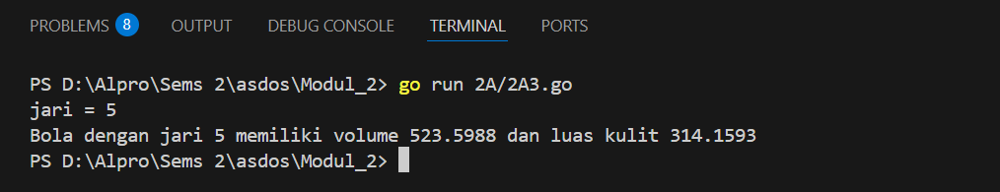

Program ini menghitung volume dan luas permukaan bola berdasarkan jari-jari yang dimasukkan pengguna. Setelah memasukkan jari-jari, program menghitung volume dengan rumus **(4/3) × π × r³** dan luas permukaan dengan rumus **4 × π × r²**, lalu menampilkan hasilnya.

### Soal 4

Dibaca nilai temperatur dalam derajat Celsius. Nyatakan temperatur tersebut dalam Fahrenheit
𝐶𝑒𝑙𝑠𝑖𝑢𝑠=(𝐹𝑎ℎ𝑟𝑒𝑛ℎ𝑒𝑖𝑡−32)×5/9 𝑅𝑒𝑎𝑚𝑢𝑟=𝐶𝑒𝑙𝑐𝑖𝑢𝑠×4/5 𝐾𝑒𝑙𝑣𝑖𝑛=(𝐹𝑎ℎ𝑟𝑒𝑛ℎ𝑒𝑖𝑡+459.67)×5/9

```go
package main

import "fmt"

func main() {

    var celcius float64

    fmt.Print("Temperatur Celsius: ")

    fmt.Scan(&celcius)

    reamur := (4.0 / 5.0) * celcius
    fahrenheit := (9.0/5.0)*celcius + 32
    kelvin := celcius + 273

    fmt.Printf("Derajat Reamur: %.0f\n", reamur)
    fmt.Printf("Derajat Fahrenheit: %.0f\n", fahrenheit)
    fmt.Printf("Derajat Kelvin: %.0f\n", kelvin)

}
```

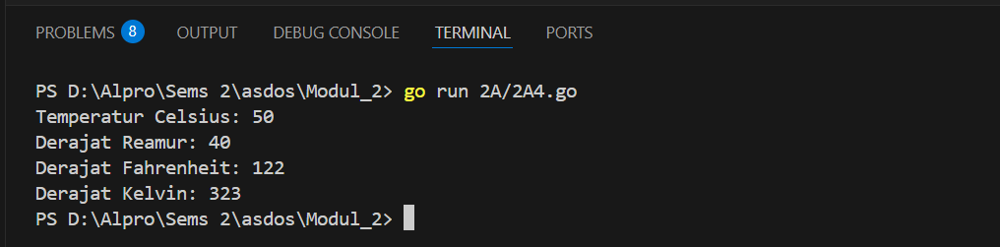

Program ini digunakan untuk mengonversi suhu dari Celsius ke Reamur, Fahrenheit, dan Kelvin. Pengguna diminta memasukkan suhu dalam Celsius, lalu program menghitung hasil konversinya menggunakan rumus matematika yang sesuai. Setelah perhitungan selesai, program menampilkan hasilnya dalam bentuk angka bulat tanpa desimal.

### Soal 5

Tipe karakter sebenarnya hanya apa yang tampak dalam tampilan. Di dalamnya tersimpan dalam bentuk biner 8 bit (byte) atau 32 bit (rune) saja.
Buat program ASCII yang akan membaca 5 buat data integer dan mencetaknya dalam format karakter. Kemudian membaca 3 buah data karakter dan mencetak 3 buah karakter setelah karakter tersebut (menurut tabel ASCII)

```go
package main

import "fmt"

func main() {

    var data1, data2, data3, data4, data5 int
    var karakter1, karakter2, karakter3 rune

    fmt.Scan(&data1, &data2, &data3, &data4, &data5)
    fmt.Scanln()
    fmt.Scanf("%c%c%c\n", &karakter1, &karakter2, &karakter3)

    karakter1 += 1
    karakter2 += 1
    karakter3 += 1

    fmt.Printf("%c%c%c%c%c\n", data1, data2, data3, data4, data5)

    fmt.Printf("%c%c%c\n", karakter1, karakter2, karakter3)

}
```

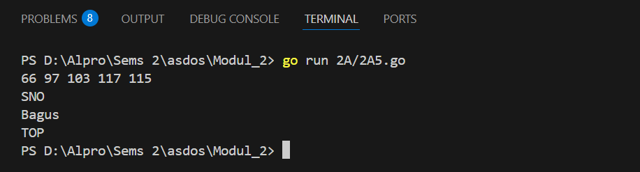

Program ini membaca lima angka dan tiga karakter dari input. Angka-angka tersebut dicetak sebagai karakter, sedangkan tiga karakter yang dimasukkan akan dinaikkan satu tingkat dalam kode ASCII sebelum dicetak kembali.

### Soal Latihan 2B

### Soal 1

Buatlah sebuah program yang menerima input berupa warna dari ke 4 gelas reaksi sebanyak 5 kali percobaan. Kemudian program akan menampilkan true apabila urutan warna sesuai dengan informasi yang diberikan pada paragraf sebelumnya, dan false untuk urutan warna lainnya.

```go
package main

import "fmt"

func main() {

    var tabungWarna1, tabungWarna2, tabungWarna3, tabungWarna4 string

    berhasil := true

  

    for i := 1; i <= 5; i++ {

        fmt.Scan(&tabungWarna1, &tabungWarna2, &tabungWarna3, &tabungWarna4)

  

        if tabungWarna1 != "merah" || tabungWarna2 != "kuning" || tabungWarna3 != "hijau" || tabungWarna4 != "ungu" {

            berhasil = false

        }
    }

    fmt.Println(berhasil)

}
```

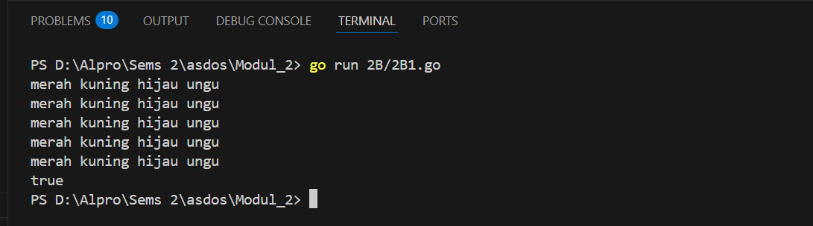
Program ini membaca empat warna dari input sebanyak lima kali dalam sebuah perulangan. Jika semua warna dalam satu set input berurutan adalah "merah", "kuning", "hijau", dan "ungu", maka variabel berhasil tetap true. Namun, jika ada satu set warna yang tidak sesuai urutan tersebut, maka berhasil akan berubah menjadi false. Setelah perulangan selesai, program mencetak nilai berhasil, yang menunjukkan apakah semua set warna memenuhi aturan atau tidak.

### Soal 2

Buatlah sebuah program yang menerima input sebuah bilangan bulat positif (dan tidak nol) N, kemudian program akan meminta input berupa nama bunga secara berulang sebanyak N kali dan nama tersebut disimpan ke dalam pita.
(Petunjuk: gunakan operasi penggabungan string dengan operator “+” ).
Tampilkan isi pita setelah proses input selesai.

```go
package main

  

import "fmt"

  

func main() {

  

    var bunga, pita string

    var jumlah int

  

    jumlah = 0

  

    for {

  

        fmt.Print("Bunga ", jumlah+1, ": ")

        fmt.Scan(&bunga)

  

        if bunga == "SELESAI" {

            break

        }

  

        pita = pita + bunga + " - "

        jumlah++

  

    }

  

    fmt.Println("Pita:", pita)

    fmt.Println("Bunga:", jumlah)

  

}
```

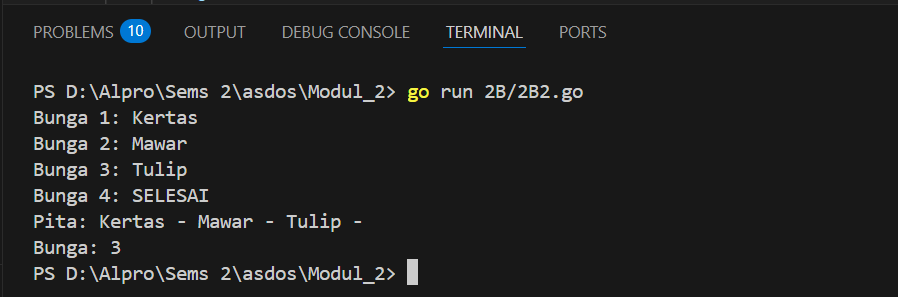

Program ini meminta pengguna untuk memasukkan nama bunga secara berulang. Setiap bunga yang dimasukkan akan ditambahkan ke dalam sebuah string pita, dipisahkan dengan " - ". Jika pengguna mengetik "SELESAI", perulangan akan berhenti. Setelah itu, program mencetak daftar bunga yang telah dimasukkan dalam bentuk pita dan jumlah total bunga yang dimasukkan sebelum perintah selesai diberikan.

### Soal 3

Buatlah program Pak Andi yang menerima input dua buah bilangan real positif yang menyatakan berat total masing-masing isi kantong terpal. Program akan terus meminta input bilangan tersebut hingga salah satu kantong terpal berisi 9 kg atau lebih.

```go
package main

  

import "fmt"

  

func main() {

  

    var kantongKiri, kantongKanan, selisih float32

    var oleng bool

  

    for {

        fmt.Print("Masukan berat belanjaan di kedua kantong: ")

        fmt.Scan(&kantongKiri, &kantongKanan)

  

        if kantongKiri < 0 || kantongKanan < 0 {

            fmt.Println("Proses selesai")

            break

        }

  

        if kantongKiri+kantongKanan > 150 {

            fmt.Println("Proses selesai")

            break

        }

  

        if kantongKiri > kantongKanan {

            selisih = kantongKiri - kantongKanan

        } else {

            selisih = kantongKanan - kantongKiri

        }

  

        oleng = selisih >= 9

        fmt.Println("Sepeda motor pak Andi akan oleng:", oleng)

    }

  

}
```


Program ini meminta pengguna untuk memasukkan berat belanjaan di dua kantong secara berulang. Jika salah satu berat bernilai negatif atau jika total berat kedua kantong melebihi 150, maka proses akan berhenti. Selisih berat antara kantong kiri dan kanan dihitung, dan jika selisihnya 9 atau lebih, variabel oleng akan bernilai true, yang berarti sepeda motor Pak Andi akan oleng. Program kemudian mencetak apakah sepeda motor akan oleng atau tidak dan mengulang proses sampai salah satu kondisi berhenti terpenuhi.

### Soal 4 a

Buatlah sebuah program yang menerima input sebuah bilangan sebagai K, kemudian menghitung dan menampilkan nilai f(K) sesuai persamaan di atas.

```go
package main

  

import "fmt"

  

func main() {

    var K float64

    fmt.Print("Nilai K = ")

    fmt.Scan(&K)

  

    fk := ((4*K + 2) * (4*K + 2)) / ((4*K + 1) * (4*K + 3))

  

    fmt.Printf("Nilai f(K) = %.10f\n", fk)

}
```

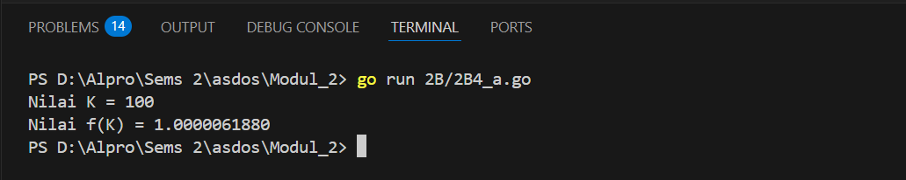

Program ini meminta pengguna untuk memasukkan nilai K, kemudian menghitung nilai fungsi f(K) berdasarkan rumus matematika yang telah ditentukan. Perhitungan dilakukan dengan memasukkan K ke dalam rumus ((4K+2)2)/((4K+1)(4K+3))((4K + 2)²) / ((4K + 1)(4K + 3))((4K+2)2)/((4K+1)(4K+3)).

### Soal 4 b

Modifikasi program sebelumnya yang menerima input integer 𝐾 dan menghitung √2 untuk 𝐾 tersebut. Hampiran √2 dituliskan dalam ketelitian 10 angka di belakang koma.

```go
package main

  

import "fmt"

  

func main() {

    var K float64

    fmt.Print("Nilai K = ")

    fmt.Scan(&K)

  

    hasil := 1.0

    for i := 0.0; i < K; i++ {

        hasil *= ((4*i + 2) * (4*i + 2)) / ((4*i + 1) * (4*i + 3))

    }

  

    fmt.Printf("Nilai akar 2 = %.10f\n", hasil)

}
```

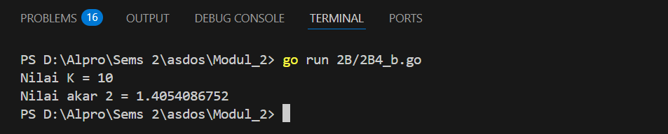

Program ini menghitung perkiraan nilai akar 2 dengan menggunakan perulangan. Dimulai dari 1, hasilnya terus dikalikan dengan rumus tertentu sebanyak `K` kali. Setelah selesai, hasil akhirnya ditampilkan dengan 10 angka di belakang desimal.

### Soal latihan 2C

### Soal 1

buatlah program BiayaPos untuk menghitung biaya pengiriman tersebut dengan ketentuan sebagai berikut!
Dari berat parsel (dalam gram), harus dihitung total berat dalam kg dan sisanya (dalam gram). Biaya jasa pengiriman adalah Rp. 10.000,- per kg. Jika sisa berat tidak kurang dari 500 gram, maka tambahan biaya kirim hanya Rp. 5,- per gram saja. Tetapi jika kurang dari 500 gram, maka tambahan biaya akan dibebankan sebesar Rp. 15,- per gram. Sisa berat (yang kurang dari 1kg) digratiskan biayanya apabila total berat ternyata lebih dari 10kg.

```go
package main

  

import "fmt"

  

func main() {

    var berat int

    fmt.Print("Berat parsel (gram): ")

    fmt.Scan(&berat)

  

    kilo := berat / 1000

    gram := berat % 1000

  

    hargaKilo := kilo * 10000

    hargaGram := 0

  

    if gram > 0 {

        if gram >= 500 {

            hargaGram = gram * 5

        } else {

            hargaGram = gram * 15

        }

    }

  

    if kilo >= 10 {

        hargaGram = 0

    }

  

    total := hargaKilo + hargaGram

  

    fmt.Printf("Detail berat: %d kg + %d gr\n", kilo, gram)

    fmt.Printf("Detail biaya: Rp. %d + Rp. %d\n", hargaKilo, hargaGram)

    fmt.Printf("Total biaya: Rp. %d\n", total)

}
```

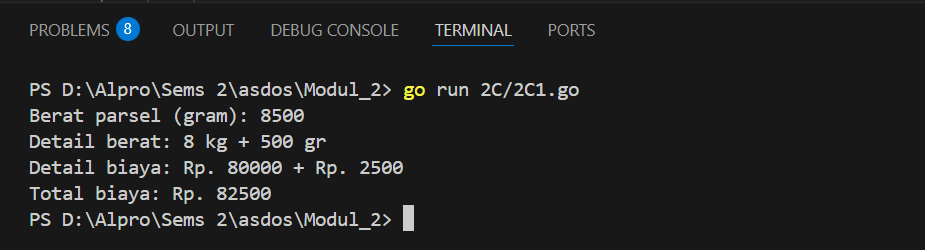

program mengambil input berat parsel dari pengguna. Berat ini kemudian dikonversi menjadi kilogram dan sisa gram. Biaya dasar dihitung berdasarkan berat dalam kilogram, dengan tarif Rp. 10.000 per kilogram. Jika ada sisa gram, program menentukan tarif tambahan: Rp. 5 per gram jika sisa gram lebih dari atau sama dengan 500 gram, dan Rp. 15 per gram jika kurang dari 500 gram.
Namun, jika berat mencapai atau melebihi 10 kg, biaya tambahan untuk gram diabaikan dan hanya biaya kilogram yang diperhitungkan. Setelah semua perhitungan selesai, program menampilkan detail berat, rincian biaya, dan total biaya pengiriman.

### Soal 2

a. Jika nam diberikan adalah 80.1, apa keluaran dari program tersebut? Apakah eksekusi program tersebut sesuai spesifikasi soal? 
b. Apa saja kesalahan dari program tersebut? Mengapa demikian? Jelaskan alur program seharusnya! 
c. Perbaiki program tersebut! Ujilah dengan masukan: 93.5; 70.6; dan 49.5. Seharusnya keluaran yang diperoleh adalah ‘A’, ‘B’, dan ‘D’.

Jawab :
a. output dari program sebelum di perbaiki itu eror
b. penggunaan else if, pemanggilan variabel yang seharusnya dipanggil itu nmk bukan nam
c. dibawah ini adalah program setelah diperbaiki

```go
package main

import "fmt"

func main() {

    var nam float64

    var nmk string

    fmt.Print("Nilai akhir mata kuliah: ")

    fmt.Scanln(&nam)

    if nam > 80 {
        nmk = "A"
    } else if nam > 72.5 && nam <= 80 {
        nmk = "AB"
    } else if nam > 65 && nam <= 72.5 {
        nmk = "B"
    } else if nam > 57.5 && nam <= 57.5 {
        nmk = "BC"
    } else if nam > 50 && nam <= 57.5 {
        nmk = "C"
    } else if nam > 40 && nam <= 50 {
        nmk = "D"
    } else if nam <= 40 && nam <= 40 {
        nmk = "E"
    }

    fmt.Println("Nilai mata kuliah: ", nmk)

}
```

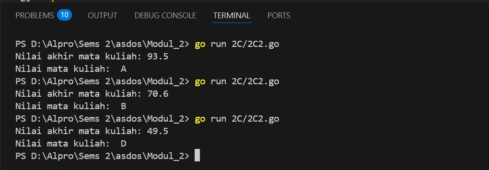

### Soal 3

Sebuah bilangan bulat b memiliki faktor bilangan f > 0 jika f habis membagi b. Contoh: 2 merupakan faktor dari bilangan 6 karena 6 habis dibagi 2. Buatlah program yang menerima input sebuah bilangan bulat b dan b > 1. Program harus dapat mencari dan menampilkan semua faktor dari bilangan tersebut! Bilangan bulat b > 0 merupakan bilangan prima p jika dan hanya jika memiliki persis dua faktor bilangan saja, yaitu 1 dan dirinya sendiri. Lanjutkan program sebelumnya. Setelah menerima masukan sebuah bilangan bulat b > 0. Program tersebut mencari dan menampilkan semua faktor bilangan tersebut. Kemudian, program menentukan apakah b merupakan bilangan prima.

```go
package main

import "fmt"

func main() {

    var bilangan, faktor int
    var prima bool

    fmt.Print("Masukan Bilangan: ")
    fmt.Scan(&bilangan)
    fmt.Print("Faktor: ")
    for i := 1; i <= bilangan; i++ {
        if bilangan%i == 0 {
            fmt.Print(i, " ")
            faktor++
        }
    }
    fmt.Println()
    if faktor == 2 {
        prima = true
    } else {
        prima = false
    }

    fmt.Println("Prima:", prima)

}
```

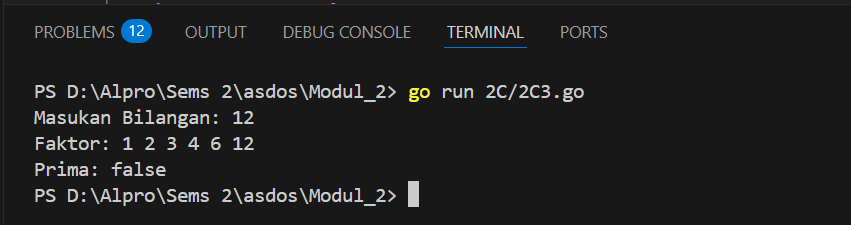

Program ini meminta pengguna memasukkan sebuah bilangan. Kemudian, program mencari dan mencetak faktor-faktor dari bilangan tersebut. Setelah itu, program mengecek apakah bilangan tersebut adalah bilangan prima. Jika hanya memiliki dua faktor (1 dan bilangan itu sendiri), maka bilangan dianggap prima. Hasilnya ditampilkan ke layar.