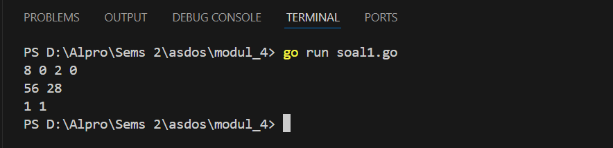
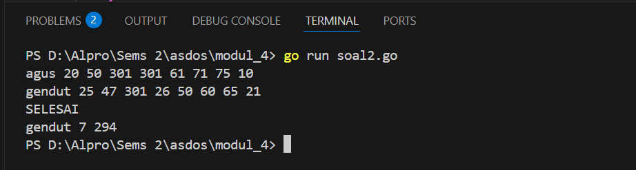
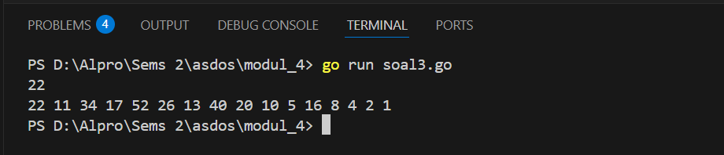

<h1 align="center">Laporan Praktikum Modul 4 <br> PROSEDUR </h1>
___
<h5 align="center">Zidane Aji Noegroho - 103112430006 </h5>
### Unguided
___
### Soal 1
Minggu ini, mahasiswa Fakultas Informatika mendapatkan tugas dari mata kuliah matematika diskrit untuk mempelajari kombinasi dan permutasi. Jonas salah seorang mahasiswa, iseng untuk mengimplementasikannya ke dalam suatu program. Oleh karena itu bersediakah kalian membantu Jonas? (tidak tentunya ya :p)
Masukan terdiri dari empat buah bilangan asli 𝑎, 𝑏, 𝑐, dan 𝑑 yang dipisahkan oleh spasi, dengan syarat 𝑎≥ 𝑐 dan 𝑏≥ 𝑑.
Keluaran terdiri dari dua baris. Baris pertama adalah hasil permutasi dan kombinasi 𝒂 terhadap 𝑐, sedangkan baris kedua adalah hasil permutasi dan kombinasi 𝑏 terhadap 𝑑.

```go
package main

import "fmt"

func faktorial(n int) int {
    if n == 0 || n == 1 {
        return 1
    }
    result := 1
    for i := 2; i <= n; i++ {
        result *= i
    }
    return result
}

func permutasi(n, r int) int {
    if n < r {
        return 0
    }
    return faktorial(n) / faktorial(n-r)
}

func kombinasi(n, r int) int {
    if n < r {
        return 0
    }
    return faktorial(n) / (faktorial(r) * faktorial(n-r))
}

func main() {
    var a, b, c, d int

    fmt.Scan(&a, &b, &c, &d)

    p1 := permutasi(a, c)
    c1 := kombinasi(a, c)
    p2 := permutasi(b, d)
    c2 := kombinasi(b, d)

    fmt.Println(p1, c1)
    fmt.Println(p2, c2)
}
```



Program ini dibuat untuk menghitung Permutasi dan Kombinasi, fungsi faktorial untuk menghitung faktorial dari suatu angka. Fungsi permutasi menggunakan faktorial untuk menghitung banyaknya susunan berbeda dari r objek yang dipilih dari n objek. Fungsi kombinasi menghitung jumlah cara memilih r objek dari n tanpa memperhatikan urutan.
Di dalam fungsi main, program membaca empat angka dari input. Dua angka pertama digunakan untuk menghitung permutasi dan kombinasi pertama, sementara dua angka berikutnya digunakan untuk menghitung permutasi dan kombinasi kedua. Hasil perhitungan kemudian ditampilkan ke layar.

### Soal 2
Kompetisi pemrograman tingkat nasional berlangsung ketat. Setiap peserta diberikan 8 soal yang harus dapat diselesaikan dalam waktu 5 jam saja. Peserta yang berhasil menyelesaikan soal paling banyak dalam waktu paling singkat adalah pemenangnya.
Buat program gema yang mencari pemenang dari daftar peserta yang diberikan. Program harus dibuat modular, yaitu dengan membuat prosedur hitungSkor yang mengembalikan total soal dan total skor yang dikerjakan oleh seorang peserta, melalui parameter formal. Pembacaan nama peserta dilakukan di program utama, sedangkan waktu pengerjaan dibaca di dalam prosedur. prosedure hitungSkor(in/out soal, skor : integer)
Setiap baris masukan dimulai dengan satu string nama peserta tersebut diikuti dengan adalah 8 integer yang menyatakan berapa lama (dalam menit) peserta tersebut menyelesaikan soal. Jika tidak berhasil atau tidak mengirimkan jawaban maka otomatis dianggap menyelesaikan dalam waktu 5 jam 1 menit (301 menit).
Satu baris keluaran berisi nama pemenang, jumlah soal yang diselesaikan, dan nilai yang diperoleh. Nilai adalah total waktu yang dibutuhkan untuk menyelesaikan soal yang berhasil diselesaikan.

```go
package main

import (
    "fmt"
)

func hitungSkor(waktu []int, soal *int, skor *int) {
    *soal = 0
    *skor = 0
    for _, t := range waktu {
        if t <= 300 {
            *soal++
            *skor += t
        }
    }
}

func main() {
    var stop string
    var waktu [8]int
    var pemenang string
    var maksSoal, totalSkor int
    var soal, skor int

    maksSoal = -1
    hasil := ""

    for {
        fmt.Scan(&stop)
        if stop == "SELESAI" {
            break
        }
        for i := 0; i < 8; i++ {
            fmt.Scan(&waktu[i])
        }
        hitungSkor(waktu[:], &soal, &skor)

        if soal > maksSoal || (soal == maksSoal && skor < totalSkor) {
            pemenang = stop
            maksSoal = soal
            totalSkor = skor
        }
    }

    if maksSoal != -1 {
        hasil = fmt.Sprintf("%s %d %d", pemenang, maksSoal, totalSkor)
    }

    fmt.Println(hasil)
}
```



Program ini dibuat untuk menentukan pemenang dalam sebuah kompetisi berdasarkan jumlah soal yang diselesaikan dan total waktu yang digunakan. Program membaca nama peserta dan waktu penyelesaian untuk 8 soal dalam bentuk angka. Jika waktu untuk menyelesaikan soal kurang dari atau sama dengan 300 detik, maka soal tersebut dihitung sebagai berhasil diselesaikan dan waktunya ditambahkan ke total skor peserta. Setiap peserta yang datanya dimasukkan akan dibandingkan. Pemenang adalah peserta yang menyelesaikan soal terbanyak. Jika ada peserta dengan jumlah soal yang sama, maka yang memiliki total waktu lebih sedikit akan dipilih sebagai pemenang. Program terus meminta input hingga menemukan kata "SELESAI", lalu mencetak nama pemenang beserta jumlah soal yang diselesaikan dan total waktu yang digunakan.

### Soal 3
Skiena dan Revilla dalam Programming Challenges mendefinisikan sebuah deret bilangan. Deret dimulai dengan sebuah bilangan bulat n. Jika bilangan n saat itu genap, maka suku berikutnya adalah ½n, tetapi jika ganjil maka suku berikutnya bernilai 3n+1. Rumus yang sama digunakan terus menerus untuk mencari suku berikutnya. Deret berakhir ketika suku terakhir bernilai 1. Sebagai contoh jika dimulai dengan n=22, maka deret bilangan yang diperoleh
adalah:
22 11 34 17 52 26 13 40 20 10 5 16 8 4 2 1
Untuk suku awal sampai dengan 1000000, diketahui deret selalu mencapai suku dengan nilai 1.
Buat program skiena yang akan mencetak setiap suku dari deret yang dijelaskan di atas untuk nilai suku awal yang diberikan. Pencetakan deret harus dibuat dalam prosedur cetakDeret yang mempunyai 1 parameter formal, yaitu nilai dari suku awal. prosedure cetakDeret(in n : integer )
Masukan berupa satu bilangan integer positif yang lebih kecil dari 1000000.
Keluaran terdiri dari satu baris saja. Setiap suku dari deret tersebut dicetak dalam baris yang dan dipisahkan oleh sebuah spasi.

```go
package main

import "fmt"  

func cetakDeret(n int) {
    for n != 1 {
        fmt.Print(n, " ")
        if n%2 == 0 {
            n /= 2
        } else {
            n = 3*n + 1
        }
    }
    fmt.Println(1)
}

func main() {
    var n int
    fmt.Scan(&n)
    cetakDeret(n)
}
```



Program akan menerima satu angka yang akan diinputkan oleh user, lalu mencetak deret angka hingga mencapai 1. Jika angka saat ini genap, maka dibagi 2. Jika ganjil, maka dikalikan 3 dan ditambah 1. Proses ini terus berulang sampai angka menjadi 1, kemudian hasilnya ditampilkan di layar.