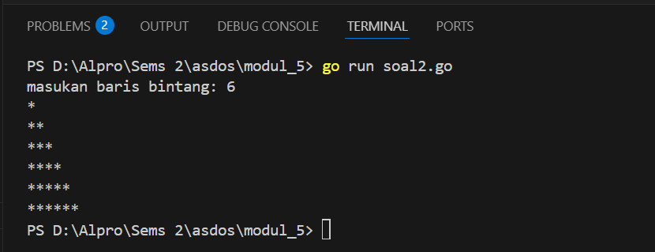
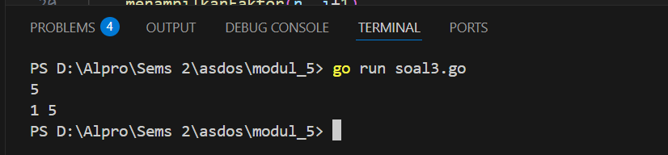
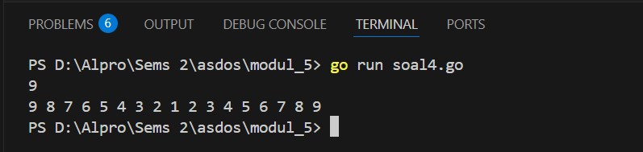
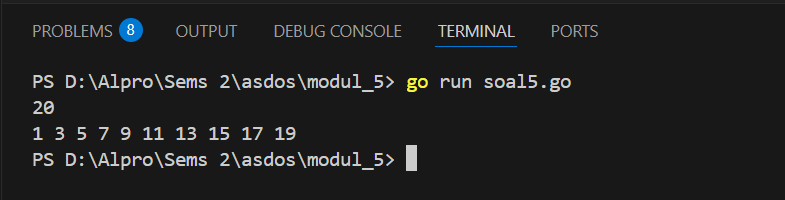
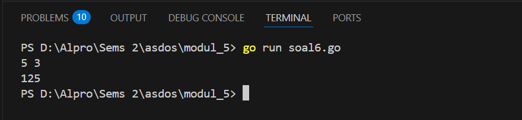

<h1 align="center">Laporan Praktikum Modul 5 <br> REKURSIF </h1>
___
<h5 align="center">Zidane Aji Noegroho - 103112430006 </h5>
### Unguided
___
### Soal 1
Deret fibonacci adalah sebuah deret dengan nilai suku ke-0 dan ke-1 adalah 0 dan 1, dan nilai suku ke-n selanjutnya adalah hasil penjumlahan dua suku sebelumnya. Secara umum dapat diformulasikan 𝑆𝑛=𝑆𝑛−1+𝑆𝑛−2 . Berikut ini adalah contoh nilai deret fibonacci hingga suku ke-10. Buatlah program yang mengimplementasikan fungsi rekursif pada deret fibonacci tersebut.

```go
package main

import (
    "fmt"
)

func main() {
    for i := 0; i <= 10; i++ {
        fmt.Printf("Suku(%d) = %d\n", i, fibonacci(i))
    }
}

func fibonacci(n int) int {
    if n == 0 {
        return 0
    } else if n == 1 {
        return 1
    } else {
        return fibonacci(n-1) + fibonacci(n-2)
    }
}
```


program untuk menghitung bilangan Fibonacci menggunakan rekursif. Fungsi fibonacci(n) mencari bilangan Fibonacci ke-n. Jika n adalah 0 atau 1, hasilnya langsung dikembalikan. Jika lebih besar, fungsi akan menjumlahkan dua bilangan Fibonacci sebelumnya. Di dalam function main, program mencetak bilangan Fibonacci dari 0 hingga 10 dengan menggunakan perulangan.

### Soal 2
Buatlah sebuah program yang digunakan untuk menampilkan pola bintang berikut ini dengan menggunakan fungsi rekursif. N adalah masukan dari user.

```go
package main

import (
    "fmt"
)

func main() {
    var n int
    fmt.Print("masukan baris bintang: ")
    fmt.Scan(&n)
    pola(n, 1)
}

func cetakBintang(n int) {
    if n == 0 {
        return
    }
    fmt.Print("*")
    cetakBintang(n - 1)
}

func pola(n, barisSekarang int) {
    if barisSekarang > n {
        return
    }
    cetakBintang(barisSekarang)
    fmt.Println()
    pola(n, barisSekarang+1)
}
```



sebuah Program yang dibut untuk membuat bintang per baris nya dan meminta jumlah baris dari user. Lalu, fungsi pola() mencetak bintang mulai dari satu hingga jumlah yang diminta. Fungsi cetakBintang() bertugas mencetak bintang dalam satu baris. Setiap baris bertambah satu bintang hingga mencapai angka yang dimasukkan.

### Soal 3
Buatlah program yang mengimplementasikan rekursif untuk menampilkan faktor bilangan dari suatu N, atau bilangan yang apa saja yang habis membagi N.
Masukan terdiri dari sebuah bilangan bulat positif N.
Keluaran terdiri dari barisan bilangan yang menjadi faktor dari N (terurut dari 1 hingga N ya).

```go
package main

import (
    "fmt"
)

func main() {
    var n int
    fmt.Scan(&n)
    menampilkanFaktor(n, 1)
}

func menampilkanFaktor(n, i int) {
    if i > n {
        return
    }
    if n%i == 0 {
        fmt.Print(i, " ")
    }
    menampilkanFaktor(n, i+1)
}
```



Program meminta user memasukkan angka, lalu fungsi menampilkanFaktor memeriksa angka dari 1 hingga angka yang telah di masukkan. Jika angka dapat membagi habis bilangan yang dimasukkan, angka itu dicetak sebagai faktor. Proses ini berulang terus hingga mencapai angka yang dimasukkan.

### Soal 4
Buatlah program yang mengimplementasikan rekursif untuk menampilkan barisan bilangan tertentu.
Masukan terdiri dari sebuah bilangan bulat positif N.
Keluaran terdiri dari barisan bilangan dari N hingga 1 dan kembali ke N.

```go
package main

import (
    "fmt"
)

func main() {
    var n int
    fmt.Scan(&n)
    kembali(n, n)
}

func kembali(n, i int) {
    fmt.Print(i, " ")
    if i == 1 {
        return
    }
    kembali(n, i-1)
    fmt.Print(i, " ")
}
```



program yang dibuat untuk mencetak angka dari n ke 1 lalu kembali lagi ke n, lalu fungsi kembali mencetak angka dari n ke 1. Saat mencapai 1, fungsi berhenti dan mulai mencetak angka kembali ke n.

### Soal 5
Buatlah program yang mengimplementasikan rekursif untuk menampilkan barisan bilangan ganjil.
Masukan terdiri dari sebuah bilangan bulat positif N.
Keluaran terdiri dari barisan bilangan ganjil dari 1 hingga N.

```go
package main

import (
    "fmt"
)

func main() {
    var n int
    fmt.Scan(&n)
    bilanganGanjil(1, n)
}

func bilanganGanjil(i, n int) {
    if i > n {
        return
    }
    fmt.Print(i, " ")
    bilanganGanjil(i+2, n)
}
```



program yang ini dibuat untuk menampilkan bilangan ganjil yang muncul dari angka 1 hingga n, lalu fungsi bilanganGanjil mencetak angka ganjil mulai dari 1 dan menambah 2 setiap pemanggilan hingga mencapai atau melewati n.

### Soal 6
Buatlah program yang mengimplementasikan rekursif untuk mencari hasil pangkat dari dua buah bilangan.
Masukan terdiri dari bilangan bulat x dan y.
Keluaran terdiri dari hasil x dipangkatkan y.
Catatan: diperbolehkan menggunakan asterik "*", tapi dilarang menggunakan import "math".

```go
package main

import (
    "fmt"
)

func main() {
    var x, y int
    fmt.Scan(&x, &y)
    fmt.Println(diPangkatKan(x, y))
}

func diPangkatKan(x, y int) int {
    if y == 0 {
        return 1
    }
    return x * diPangkatKan(x, y-1)
}
```



Program yang dimana meminta user untuk memasukkan 2 buah bilangan untuk dipangkatkan, yaitu x (bilangan) dan y (pangkat). Fungsi diPangkatKan mengalikan x dengan hasil pemanggilan dirinya sendiri hingga pangkat y menjadi 0, di mana hasilnya akan menjadi 1.