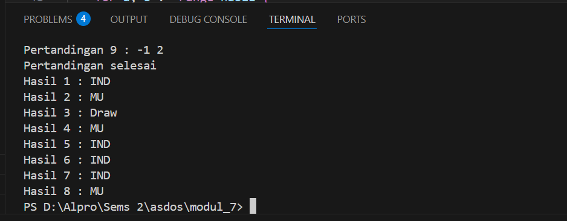

<h1 align="center">Laporan Praktikum Modul 7 <br> STRUCT & ARRAY </h1>
___
<h5 align="center">Zidane Aji Noegroho - 103112430006 </h5>
### Unguided
___

### Soal 1
Suatu lingkaran didefinisikan dengan koordinat titik pusat (𝑐𝑥,𝑐𝑦) dengan radius 𝑟. Apabila diberikan dua buah lingkaran, maka tentukan posisi sebuah titik sembarang (𝑥,𝑦) berdasarkan dua lingkaran tersebut. Gunakan tipe bentukan titik untuk menyimpan koordinat, dan tipe bentukan lingkaran untuk menyimpan titik pusat lingkaran dan radiusnya.
Masukan terdiri dari beberapa tiga baris. Baris pertama dan kedua adalah koordinat titik pusat dan radius dari lingkaran 1 dan lingkaran 2, sedangkan baris ketiga adalah koordinat titik sembarang. Asumsi sumbu x dan y dari semua titik dan juga radius direpresentasikan dengan bilangan bulat.
Keluaran berupa string yang menyatakan posisi titik "Titik di dalam lingkaran 1 dan 2", "Titik di dalam lingkaran 1", "Titik di dalam lingkaran 2", atau "Titik di luar lingkaran 1 dan 2".

```go
package main

import (
	"fmt"
	"math"
)

type titik struct {
	x, y float64
}

type lingkaran struct {
	titikPusat titik
	radius     float64
}

func perhitunganJarak(a, b titik) float64 {
	return math.Sqrt(math.Pow(a.x-b.x, 2) + math.Pow(a.y-b.y, 2))
}

func dalamLingkaran(l lingkaran, t titik) bool {
	return perhitunganJarak(l.titikPusat, t) <= l.radius
}

func main() {
	var lingkaran [2]lingkaran
	var titik titik

	fmt.Scan(&lingkaran[0].titikPusat.x, &lingkaran[0].titikPusat.y, &lingkaran[0].radius)

	fmt.Scan(&lingkaran[1].titikPusat.x, &lingkaran[1].titikPusat.y, &lingkaran[1].radius)

	fmt.Scan(&titik.x, &titik.y)

	diDalamLingkaran1 := dalamLingkaran(lingkaran[0], titik)
	diDalamLingkaran2 := dalamLingkaran(lingkaran[1], titik)

	if diDalamLingkaran1 && diDalamLingkaran2 {
		fmt.Println("Titik di dalam lingkaran 1 dan 2")
	} else if diDalamLingkaran1 {
		fmt.Println("Titik di dalam lingkaran 1")
	} else if diDalamLingkaran2 {
		fmt.Println("Titik di dalam lingkaran 2")
	} else {
		fmt.Println("Titik di luar lingkaran 1 dan 2")
	}
}
```


Program ini menggunakan struct untuk merepresentasikan data titik dan lingkaran. Struct titik menyimpan dua nilai berupa koordinat x dan y, sedangkan struct lingkaran menyimpan informasi tentang sebuah lingkaran yang terdiri dari titik pusat (yang juga berupa struct titik) dan nilai radius atau jari-jari. Di dalam fungsi main, program mendeklarasikan sebuah array berisi dua elemen bertipe lingkaran, yang artinya program akan bekerja dengan dua buah lingkaran sekaligus. Selain itu, program juga mendeklarasikan sebuah variabel bertipe titik untuk menampung input titik yang akan dicek. Struct membantu menyusun data yang kompleks agar lebih mudah digunakan, dan array memudahkan pengelolaan data yang jumlahnya lebih dari satu dengan tipe yang sama.

### Soal 2
Sebuah array digunakan untuk menampung sekumpulan bilangan bulat. Buatlah program yang digunakan untuk mengisi array tersebut sebanyak N elemen nilai. Asumsikan array memiliki kapasitas penyimpanan data sejumlah elemen tertentu. Program dapat menampilkan beberapa informasi berikut:
a.
Menampilkan keseluruhan isi dari array.
b.
Menampilkan elemen-elemen array dengan indeks ganjil saja.
c.
Menampilkan elemen-elemen array dengan indeks genap saja (asumsi indek ke-0 adalah genap).
d.
Menampilkan elemen-elemen array dengan indeks kelipatan bilangan x. x bisa diperoleh dari masukan pengguna.
e.
Menghapus elemen array pada indeks tertentu, asumsi indeks yang hapus selalu valid. Tampilkan keseluruhan isi dari arraynya, pastikan data yang dihapus tidak tampil
f.
Menampilkan rata-rata dari bilangan yang ada di dalam array.
g.
Menampilkan standar deviasi atau simpangan baku dari bilangan yang ada di dalam array tersebut.
h.
Menampilkan frekuensi dari suatu bilangan tertentu di dalam array yang telah diisi tersebut.

```go
package main

import (
	"fmt"
	"math"
)

func main() {
	var n int
	fmt.Print("Masukkan jumlah elemen array: ")
	fmt.Scan(&n)

	// Membuat array sebanyak n elemen
	array := make([]int, n)
	fmt.Println("Masukkan elemen-elemen array:")
	for i := 0; i < n; i++ {
		fmt.Printf("Elemen ke-%d: ", i)
		fmt.Scan(&array[i])
	}

	// poin a: Menampilkan seluruh isi array
	fmt.Println("\na. Seluruh isi array:")
	tampilkanArray(array)

	// poin b: Menampilkan elemen dengan indeks ganjil
	fmt.Println("\nb. Elemen dengan indeks ganjil:")
	for i := 1; i < len(array); i += 2 {
		fmt.Print(array[i], " ")
	}

	// poin c: Menampilkan elemen dengan indeks genap
	fmt.Println("\n\nc. Elemen dengan indeks genap:")
	for i := 0; i < len(array); i += 2 {
		fmt.Print(array[i], " ")
	}

	// poin d: Menampilkan elemen dengan indeks kelipatan x
	var x int
	fmt.Print("\n\nd. Masukkan nilai x (untuk indeks kelipatan x): ")
	fmt.Scan(&x)
	fmt.Println("Elemen dengan indeks kelipatan", x, ":")
	for i := 0; i < len(array); i++ {
		if i%x == 0 {
			fmt.Print(array[i], " ")
		}
	}

	// poin e: Menghapus elemen array pada indeks tertentu
	var indexHapus int
	fmt.Print("\n\ne. Masukkan indeks yang ingin dihapus: ")
	fmt.Scan(&indexHapus)
	if indexHapus >= 0 && indexHapus < len(array) {
		// Menghapus elemen pada indeks yang diminta
		array = append(array[:indexHapus], array[indexHapus+1:]...)
		fmt.Println("Array setelah penghapusan:")
		tampilkanArray(array)
	} else {
		fmt.Println("Indeks tidak valid!")
	}

	// poin f: Menampilkan rata-rata dari elemen array
	fmt.Println("\nf. Rata-rata dari elemen array:")
	if len(array) > 0 {
		rata := hitungRataRata(array)
		fmt.Printf("Rata-rata: %.2f\n", rata)

		// poin g: Menampilkan standar deviasi dari elemen array
		fmt.Println("\ng. Simpangan baku dari elemen array:")
		sd := hitungStandarDeviasi(array, rata)
		fmt.Printf("Standar deviasi: %.2f\n", sd)
	} else {
		fmt.Println("Array kosong, tidak bisa menghitung rata-rata dan simpangan baku.")
	}

	// poin h: Menampilkan frekuensi dari suatu bilangan
	var cari int
	fmt.Print("\n\nh. Masukkan bilangan yang ingin dicari frekuensinya: ")
	fmt.Scan(&cari)
	frek := hitungFrekuensi(array, cari)
	fmt.Printf("Frekuensi %d dalam array: %d\n", cari, frek)
}

// Fungsi untuk menampilkan isi array
func tampilkanArray(arr []int) {
	for _, v := range arr {
		fmt.Print(v, " ")
	}
	fmt.Println()
}

// Fungsi untuk menghitung rata-rata
func hitungRataRata(arr []int) float64 {
	total := 0
	for _, v := range arr {
		total += v
	}
	return float64(total) / float64(len(arr))
}

// Fungsi untuk menghitung standar deviasi
func hitungStandarDeviasi(arr []int, rata float64) float64 {
	var total float64
	for _, v := range arr {
		total += math.Pow(float64(v)-rata, 2)
	}
	varian := total / float64(len(arr))
	return math.Sqrt(varian)
}

// Fungsi untuk menghitung frekuensi kemunculan bilangan
func hitungFrekuensi(arr []int, target int) int {
	count := 0
	for _, v := range arr {
		if v == target {
			count++
		}
	}
	return count
}
```

### Soal 3
Sebuah program digunakan untuk menyimpan dan menampilkan nama-nama klub yang memenangkan pertandingan bola pada suatu grup pertandingan. Buatlah program yang digunakan untuk merekap skor pertandingan bola 2 buah klub bola yang berlaga.
Pertama-tama program meminta masukan nama-nama klub yang bertanding, kemudian program meminta masukan skor hasil pertandingan kedua klub tersebut. Yang disimpan dalam array adalah nama-nama klub yang menang saja.
Proses input skor berhenti ketika skor salah satu atau kedua klub tidak valid (negatif). Di akhir program, tampilkan daftar klub yang memenangkan pertandingan.
```go
package main

import (
	"fmt"
)

type klub struct {
	klubA string
	klubB string
}

type skorPertandingan struct {
	skorA int
	skorB int
}

func main() {
	var klub klub
	var hasil []string
	var skor skorPertandingan
	var i int = 1

	fmt.Print("Klub A : ")
	fmt.Scan(&klub.klubA)

	fmt.Print("Klub B : ")
	fmt.Scan(&klub.klubB)

	for {
		fmt.Printf("Pertandingan %d : ", i)
		fmt.Scan(&skor.skorA, &skor.skorB)

		if skor.skorA < 0 || skor.skorB < 0 {
			fmt.Println("Pertandingan selesai")
			break
		}

		if skor.skorA > skor.skorB {
			hasil = append(hasil, klub.klubA)
		} else if skor.skorA < skor.skorB {
			hasil = append(hasil, klub.klubB)
		} else {
			hasil = append(hasil, "Draw")
		}
		i++
	}

	for a, b := range hasil {
		fmt.Printf("Hasil %d : %s\n", a+1, b)
	}
}
```



Program ini dibuat untuk mencatat hasil pertandingan antara dua klub. Pertama, user memasukkan nama Klub A dan Klub B. Lalu program akan terus meminta skor dari kedua klub untuk setiap pertandingan. Kalau skor Klub A lebih besar, Klub A menang. Kalau skor Klub B lebih besar, Klub B menang. Kalau skornya sama, hasilnya draw. Semua hasil ini disimpan. Program akan berhenti mencatat kalau ada skor yang dimasukkan bernilai negatif. Setelah itu, semua hasil pertandingan akan ditampilkan satu per satu.

### Soal 4
Sebuah array digunakan untuk menampung sekumpulan karakter, Anda diminta untuk membuat sebuah subprogram untuk melakukan membalikkan urutan isi array dan memeriksa apakah membentuk palindrom.
Lengkapi potongan algoritma pada modul.

```go
package main

import "fmt"

const NMAX int = 127

type tabel [NMAX]rune

// Fungsi untuk mengisi array karakter
func isiArray(t *tabel, n *int) {
	var ch rune
	*n = 0

	for *n < NMAX {
		fmt.Scanf("%c", &ch)
		if ch == '.' {
			break
		}
		t[*n] = ch
		*n++
	}
}

// Fungsi untuk mencetak array karakter
func cetakArray(t tabel, n int) {
	for i := 0; i < n; i++ {
		fmt.Printf("%c", t[i])
	}
	fmt.Println()
}

// Fungsi untuk membalik isi array karakter
func balikanArray(t *tabel, n int) {
	for i := 0; i < n/2; i++ {
		t[i], t[n-1-i] = t[n-1-i], t[i]
	}
}

// Fungsi untuk memeriksa apakah array adalah palindrom
func Palindrom(t tabel, n int) bool {
	for i := 0; i < n/2; i++ {
		if t[i] != t[n-1-i] {
			return false
		}
	}
	return true
}

func main() {
	var tab tabel
	var m int

	isiArray(&tab, &m)
	balikanArray(&tab, m)

	fmt.Print("Teks: ")
	cetakArray(tab, m)

	fmt.Print("Reverse: ")
	cetakArray(tab, m)

	if Palindrom(tab, m) {
		fmt.Println("Palindrom", true)
	} else {
		fmt.Println("Palindrom", false)
	}
}
```


Program ini membaca karakter satu per satu sampai ketemu tanda titik (.) sebagai tanda berhenti. Semua karakter yang dibaca disimpan dalam array. Setelah itu, isi array dibalik urutannya. Program lalu mencetak teks asli dan versi yang sudah dibalik. Terakhir, program cek apakah teks tersebut palindrom atau tidak. Palindrom artinya teksnya sama saat dibaca dari depan maupun dari belakang. Jika iya, akan ditampilkan "Palindrom true", kalau tidak "Palindrom false".